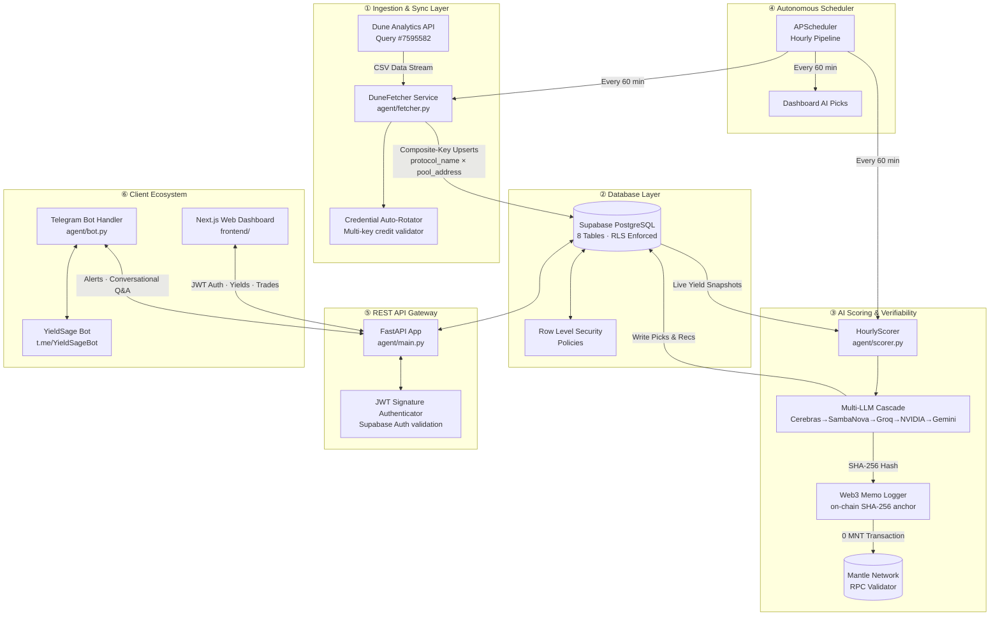
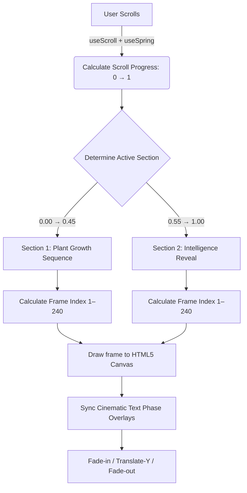
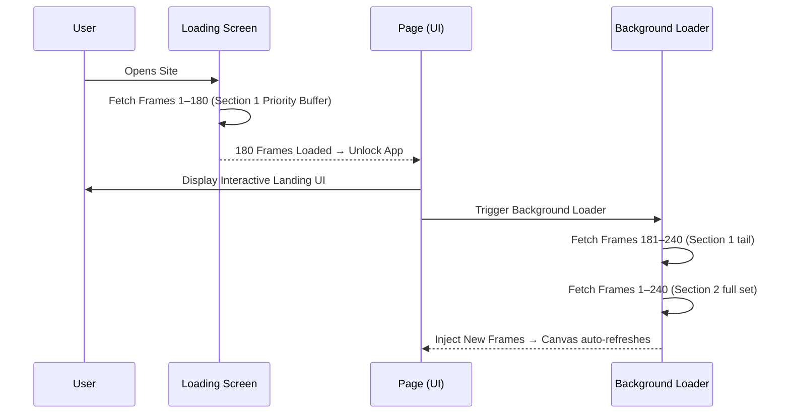
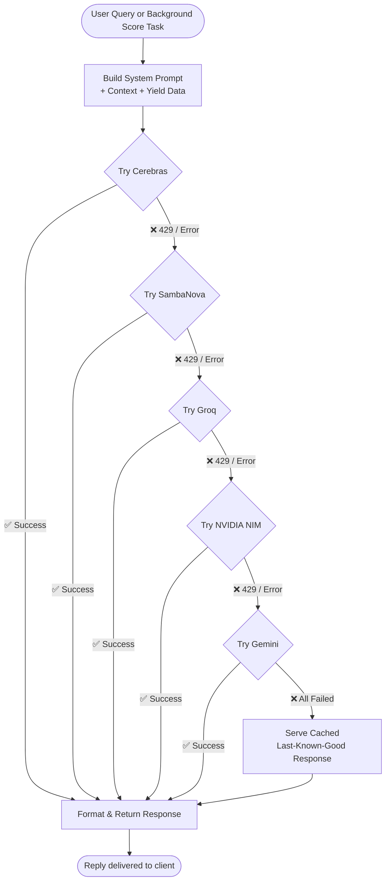
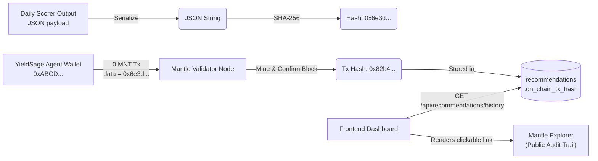
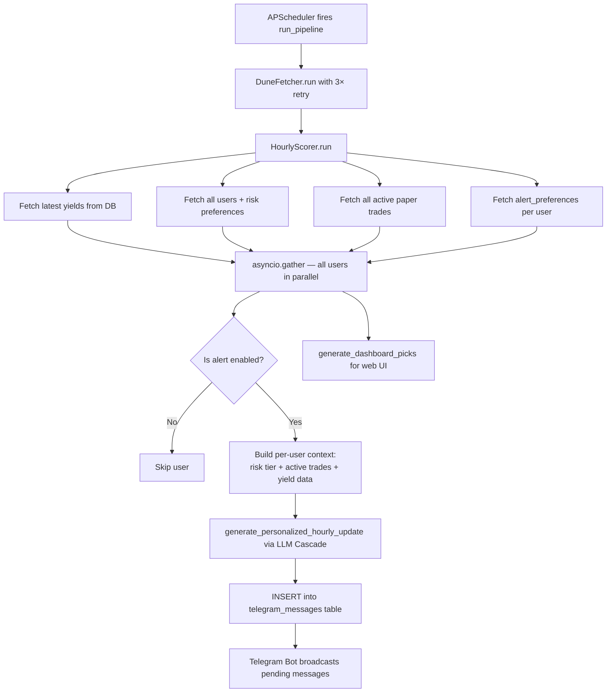
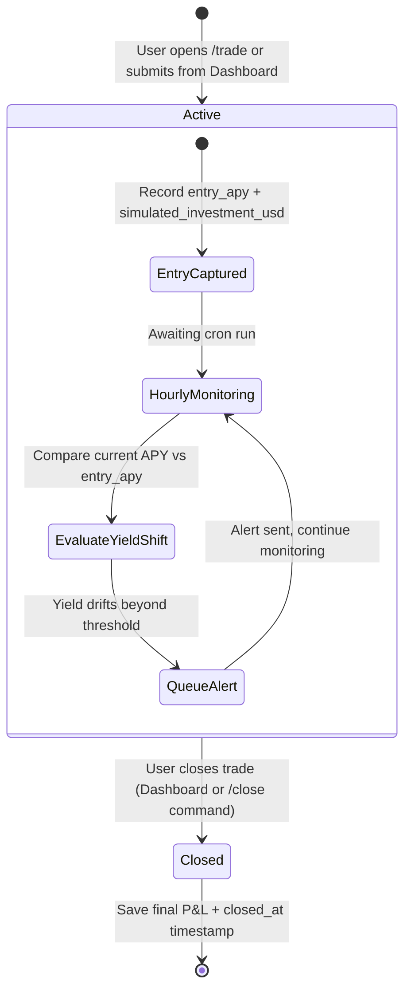
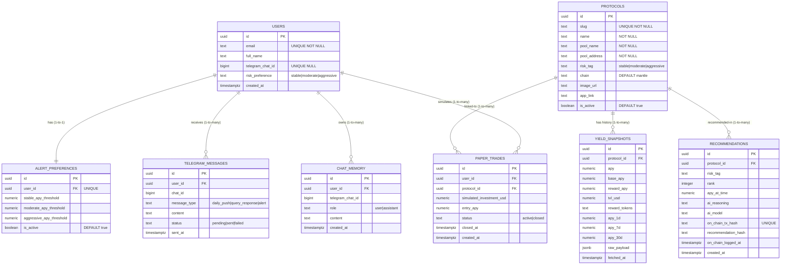
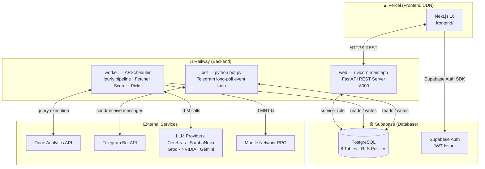

<p align="center">
  
</p>

<p align="center">
  
</p>

<h1 align="center">YieldSage</h1>

<p align="center">
  <strong>Autonomous Yield Intelligence &amp; Paper Trading Agent — Built on the Mantle Network</strong>
</p>

<p align="center">
  <a href="https://yieldsageai.xyz"></a>&nbsp;
  <a href="https://t.me/YieldSageBot"></a>&nbsp;
  <a href="https://x.com/yieldsageai"></a>&nbsp;
  <a href="./docs/system_architecture.md"></a>&nbsp;
  <a href="./docs/api_documentation.md"></a>
</p>

<p align="center">
  
  
  
  
  
  
  
  
  
</p>

---

> **YieldSage** is an industrial-grade, fully autonomous yield intelligence ecosystem purpose-built for the **Mantle Network**. It continuously tracks real-time liquidity pool APYs and TVLs across every major Mantle protocol, generates risk-adjusted yield recommendations through a fault-tolerant multi-provider LLM cascade, cryptographically anchors all advisory decisions on-chain for verifiability, and delivers live intelligence through both a cinematic Next.js Pro Dashboard and a conversational Telegram AI agent.

---

## 📖 Table of Contents

- [🏛️ Grand System Architecture](#-grand-system-architecture)
- [✨ Feature Highlights](#-feature-highlights)
- [🎬 Cinematic UI/UX Engine](#-cinematic-uiux-engine)
- [⚙️ Backend — Python Agent](#-backend--python-agent)
  - [Data Ingestion & Key Rotation](#1-data-ingestion--dune-key-rotation)
  - [Multi-Provider LLM Cascade](#2-multi-provider-llm-cascade)
  - [On-Chain Verifiability Layer](#3-on-chain-verifiability-layer)
  - [Hourly Scoring & Alerts Pipeline](#4-hourly-scoring--personalized-alerts-pipeline)
  - [Paper Trading Simulation Engine](#5-paper-trading-simulation-engine)
  - [FastAPI REST Gateway](#6-fastapi-rest-gateway)
  - [JWT Authentication & RLS Security](#7-jwt-authentication--rls-security)
- [🖥️ Frontend — Next.js Dashboard](#️-frontend--nextjs-pro-dashboard)
  - [Landing Page Scrollytelling](#1-landing-page--scrollytelling-engine)
  - [Pro Dashboard](#2-pro-dashboard)
  - [Docs Page](#3-docs-page)
- [🗄️ Database Schema](#️-database-schema--erd)
- [📂 Project Structure](#-project-structure--module-mapping)
- [🔧 Tech Stack](#-complete-tech-stack)
- [🌐 Deployment Topology](#-deployment-topology)
- [⚙️ Environment Variables](#️-environment-variables-reference)
- [🚀 Setup & Running Locally](#-setup--running-locally)
- [📚 Documentation Library](#-documentation-library)
- [🗺️ Roadmap](#️-roadmap)

---

## 🏛️ Grand System Architecture

YieldSage is architected as a fully decoupled, service-oriented system. Data flows from on-chain Mantle liquidity contracts → through Dune Analytics → into a Python ingestion pipeline → validated and AI-scored → persisted into Supabase → served through a FastAPI REST layer → consumed by both the Next.js dashboard and the Telegram bot.



---

## ✨ Feature Highlights

| Feature | Description |
|---|---|
| 🔄 **Autonomous Hourly Sync** | Dune Analytics query #7595582 executes and streams pool data every hour via APScheduler. No manual intervention required. |
| 🔑 **Dune API Key Rotation** | A pool of comma-separated Dune API keys is validated for credit usage. Exhausted keys are automatically rotated so ingestion never misses a cycle. |
| 🤖 **5-Provider LLM Cascade** | Cerebras → SambaNova → Groq → NVIDIA → Gemini. Falls back through each provider on rate-limit (HTTP 429) or failure. Serves cached responses if all fail. |
| ⛓️ **On-Chain Proof-of-Recommendation** | Every AI scoring batch is SHA-256 hashed and logged as a 0-MNT transaction on the Mantle Network. Permanently auditable on Mantle Explorer. |
| 📊 **Real-Time Yield Leaderboard** | Full-width filterable, searchable, sortable table with 1D / 7D / 30D trend pills, risk-tier badges, TVL, protocol logos, and on-chain links. |
| 💬 **Conversational Telegram AI Agent** | Multi-turn memory, slash commands (`/yields`, `/top`, `/trade`, `/portfolio`, `/alerts`), and natural language DeFi advisory powered by the LLM cascade. |
| 📈 **Paper Trading Simulator** | Open, monitor, and close mock yield-bearing positions. Continuous-time APY accrual math tracks P&L in real-time against live pool rates. |
| 🧩 **Risk Tier Classification** | Pools are auto-classified as `stable` (stablecoin pairs) or `moderate` (volatile asset pairs) based on asset name analysis. |
| 🔒 **Supabase RLS Security** | Row Level Security policies enforce that users can only read/write their own trades, alerts, and chat memory. Public yield data is read-only. |
| 📡 **Personalized Hourly Alerts** | The scorer evaluates each user's active paper trades against live yields and pushes tailored Telegram alerts when significant drift is detected. |

---

## 🎬 Cinematic UI/UX Engine

The visual identity of YieldSage is centered around a high-performance **Scrollytelling Engine** — the feature users fall in love with first. Every interaction is deliberate and kinetic.

### 1. Canvas Scrubbing & Spring Physics

The landing page runs a **1,300vh** scroll experience that scrubs through a **480-frame, two-section 3D animation sequence** rendered at high resolution.

- **Canvas Scrubbing** — High-resolution JPEGs rendered directly onto an HTML5 `<canvas>` via `requestAnimationFrame`. The frame index is perfectly interpolated against Framer Motion's `useScroll` + `useSpring` physics.
- **Spring Interpolation** — Scroll position is smoothed through configurable spring damping, giving the animation a natural acceleration and deceleration response — not a linear scrub.
- **Cinematic Text Overlays** — Text blocks are timed to exact scroll phases. They fade in, translate on the Y-axis, and fade out in sync with key 3D animation moments (plant sprouting, intelligence reveal).
- **Graceful Degradation** — If a user scrolls faster than frames can load, the engine falls back to the nearest cached frame — no blank flashes, no stuttering.



### 2. Progressive Frame Loading Architecture

Delivering **480 high-resolution images (~145MB total)** without blocking the loading screen required a custom progressive streaming buffer.

- **Initial Block (180 frames)** — The custom loading screen holds the user until the first 180 frames of Section 1 download (~70% of the initial scroll experience), ensuring a buttery-smooth first impression.
- **Background Hydration** — Once unblocked, the app renders immediately. The remaining 60 Section-1 frames and all 240 Section-2 frames stream silently in the background. The canvas auto-refreshes as new frames arrive via a `Set`-based registry.



### 3. Cinematic Loading Screen

The loading screen is a core brand experience — not a placeholder.

- **Glitch Typography** — "YIELDSAGE" initializes with a cryptographic character-scramble effect that resolves into the brand text frame-by-frame.
- **Laser Scanline** — A glowing green gradient sweeps across the central logo, accompanied by orbiting status dots on inverse rotation paths.
- **Real-time Progress** — A highly stylised progress bar with a hex-grid readout tracks the exact percentage of the 180-frame initial buffer as it loads.
- **Hex Grid Overlay** — A faint hexagonal grid pattern (Mantle brand motif) pulses behind the logo during the load phase.

### 4. Ambient Micro-Interactions & Effects

Every non-canvas section of the site feels alive through layered micro-interactions:

| Effect | Implementation |
|---|---|
| **Mouse Spotlight** | A reactive blurred radial gradient follows the user's cursor — `mouse-gradient-background.tsx` |
| **CRT/Vignette** | Global CSS overlays apply cinematic vignetting and faint scanlines across the entire viewport |
| **Floating Particles** | Ambient glowing particles drift upward at emotional peaks of the scroll journey |
| **Scroll-to-Explore Indicator** | Glassmorphic scroll indicator with pulsating mouse wheel + bouncing chevron; fades on first scroll |
| **iOS Phone Bezel** | The AI agent preview is rendered inside a photo-realistic iOS bezel frame with a typewriter chat loop |
| **Floating AI Bubble** | An animated bouncing/pulsing AI launcher bubble pinned to the bottom-right, linking to `t.me/YieldSageBot` |
| **Lenis Smooth Scroll** | `lenis` library wraps the entire page for silky inertial scroll physics |
| **DeFi TVL Tooltip** | Glassmorphic info tooltip on the TVL card explains data coverage vs DeFiLlama with a hover |

### 5. Landing Page Navigation

Replaced all placeholder nav links with real, semantically meaningful anchors:

| Label | Destination |
|---|---|
| Features | `#features` (Core Capabilities section) |
| Intelligence | `#agent` (AI Agent Demo section) |
| Dashboard | `/dashboard` (Full Pro Dashboard) |
| Docs | `/docs` (Technical Documentation) |
| Launch App | `/dashboard` (Primary CTA) |

---

## ⚙️ Backend — Python Agent

The entire backend is a Python monorepo under `agent/`. It runs three concurrent processes: the FastAPI REST server, the APScheduler pipeline, and the Telegram bot thread — all managed from a single `main.py` lifespan.

### 1. Data Ingestion & Dune Key Rotation

`agent/fetcher.py` — `DuneFetcher` class.

The fetcher pulls structured pool data from **Dune Analytics Query #7595582**, which aggregates all active Mantle DeFi protocol pools with APY, TVL, Base APY, Reward APY, and 1D/7D/30D trend fields.

**Key rotation algorithm:**
1. On startup, loads the last-used API key index from `fetcher_state.json`.
2. Before each session, calls `POST /api/v1/usage` for each key in the pool to validate credit usage.
3. Switches to the first key that has credits remaining.
4. After a successful session, rotates to the next key (saving state) to distribute usage evenly.
5. If all keys are exhausted, logs a critical error but does not crash — returns the current key as fallback.

**Composite-key upsert logic:**
- Composite key = `(protocol_name, pool_address)`
- Prevents duplicate pool registration when a protocol operates multiple assets on the same contract.
- Auto-detects stablecoin pools by checking if the asset name contains `usd` or `dai` → assigns `risk_tag = stable`.
- Updates `image_url` and `app_link` metadata on existing protocols if Dune returns richer data than what's in the DB.

```mermaid
sequenceDiagram
    autonumber
    participant F as DuneFetcher
    participant D as Dune Analytics API
    participant DB as Supabase DB

    F->>F: Load key index from fetcher_state.json
    F->>D: POST /api/v1/usage (validate credits per key)
    D-->>F: credits_used / credits_included
    F->>D: POST /query/7595582/execute (trigger execution)
    D-->>F: execution_id

    loop Every 15 seconds
        F->>D: GET /execution/{id}/status
        D-->>F: PENDING → COMPLETED
    end

    F->>D: GET /query/7595582/results/csv
    D-->>F: CSV Stream (Protocol, Pool Address, APY, TVL...)

    Note over F,DB: Composite Key: (protocol_name, pool_address)
    F->>DB: SELECT id, name, pool_address FROM protocols
    DB-->>F: Existing protocol registry

    rect rgb(15,30,15)
        Note over F: Register new protocols (not seen before)
        F->>DB: INSERT INTO protocols (slug, name, pool_name, pool_address, risk_tag, chain)
    end

    F->>DB: INSERT INTO yield_snapshots (apy, base_apy, reward_apy, tvl_usd, apy_1d, apy_7d, apy_30d...)
    DB-->>F: Acknowledge write
    F->>F: rotate_key() → save_state()
```



**Scheduler retry policy (in `scheduler.py`):**
- Fetcher is retried up to **3 times** with exponential backoff (30s → 60s → 120s).
- If all fetch attempts fail, the scoring step is skipped entirely for that hour — the pipeline never crashes.

### 2. Multi-Provider LLM Cascade

`agent/ai_service.py` — `AIService` class.

To guarantee near-100% uptime for both **real-time Telegram queries** and **background scoring**, all LLM calls are routed through a cascading fallback engine across five independent providers:

```
Cerebras (gpt-oss-120b / zai-glm-4.7)
    ↓ on 429 / Exception
SambaNova (Meta-Llama-3.3-70B-Instruct / gemma-3-12b-it)
    ↓ on 429 / Exception
Groq (llama-3-3-70b-versatile)
    ↓ on 429 / Exception
NVIDIA NIM (meta/llama-3.3-70b-instruct / llama-3.1-70b-instruct)
    ↓ on 429 / Exception
Gemini (gemini-2.5-flash-lite / gemini-2.5-flash)
    ↓ if all fail
Last-Known-Good Cache (secure, locally stored fallback response)
```

> For **background scoring** tasks (hourly pipeline), the priority is reversed — NVIDIA and Gemini are tried first to preserve Cerebras/SambaNova high-speed burst capacity for interactive user chats.



The `ai_service.py` also includes:
- **`get_recent_yields()`** — Fetches the latest snapshot per active pool from Supabase.
- **`generate_personalized_hourly_update()`** — Builds per-user context (risk preference, active trades, yield shifts) and generates tailored alert copy.
- **`generate_dashboard_picks()`** — Produces ranked AI recommendations for the Pro Dashboard's AI Picks panel.
- **`search_context()`** — Uses DuckDuckGo scraping to inject live web search context into advisory responses.
- **Chat memory** — Reads/writes `chat_memory` table (last N turns per user) to maintain multi-turn conversation state.

### 3. On-Chain Verifiability Layer

`agent/scorer.py` (recommendation logging via `web3`).

Every daily recommendation batch generated by the AI Scorer is cryptographically anchored on the **Mantle Network** to make all advisory outputs tamper-proof and independently auditable.

1. **Hash Generation** — The complete recommendation payload (timestamp, ranking, risk tiers, recommended APYs, model name) is serialized to JSON and SHA-256 hashed.
2. **On-Chain Log** — A 0-value self-transaction is submitted from the YieldSage agent wallet to the Mantle RPC node. The SHA-256 hash is embedded as hexadecimal bytes in the transaction `data` field.
3. **Hash Storage** — The resulting Mantle transaction hash is written to `recommendations.on_chain_tx_hash` in Supabase.
4. **Dashboard Verification** — The frontend dashboard reads this field and renders a direct hyperlink to the Mantle Explorer, allowing anyone to verify the recommendation was logged at that exact time.



### 4. Hourly Scoring & Personalized Alerts Pipeline

`agent/scorer.py` — `HourlyScorer` class.

Runs concurrently for ALL registered users using `asyncio.gather` — the pipeline time scales to the latency of one user, not N users.



### 5. Paper Trading Simulation Engine

`agent/routers/paper_trades.py`

Allows any authenticated user to open simulated DeFi positions against live pool rates. Position value accrues in real-time using continuous-time APY math.

**Mathematical Accrual Model:**

Given:
- $I_0$ = Simulated investment (USD)
- $APY$ = Pool's current annual percentage yield (%)  
- $T_{entry}$ = UNIX timestamp when trade was opened
- $T_{now}$ = Current system time

$$D = \max\left(\frac{T_{now} - T_{entry}}{86400}, \ 0\right) \quad \text{(fractional days held)}$$

$$Profit = I_0 \times \frac{APY}{100} \times \frac{D}{365}$$

$$Value_{current} = I_0 + Profit$$



**Trade lifecycle API endpoints:**
- `POST /api/paper-trades` — Open new position
- `GET /api/paper-trades` — List all user positions with live P&L
- `PUT /api/paper-trades/{id}/close` — Close position and freeze P&L

### 6. FastAPI REST Gateway

`agent/main.py` — Manages app lifespan, CORS, and router registration.

| Router | Prefix | Purpose |
|---|---|---|
| `stats.py` | `/api/stats` | Dashboard headline metrics (TVL, APY, protocol count, etc.) |
| `yields.py` | `/api/yields` | Yield leaderboard, search, filters, historical chart data |
| `protocols.py` | `/api/protocols` | Protocol registry, metadata, and individual pool detail |
| `recommendations.py` | `/api/recommendations` | AI picks, on-chain tx hashes, recommendation history |
| `user.py` | `/api/user` | User profile, risk preference, connection codes |
| `paper_trades.py` | `/api/paper-trades` | Trade management: open, list, close |

**CORS policy** — Strictly allows only:
- `http://localhost:3000` (local dev)
- `http://localhost:3001` (local alt port)
- `https://yieldsageai.xyz` (production)
- `https://www.yieldsageai.xyz` (production WWW)

**Built-in health endpoints:**
- `GET /` — Service identity + version + timestamp
- `GET /health` — Scheduler running status + bot thread alive status
- `GET /docs` — Swagger interactive API documentation (auto-generated)
- `GET /redoc` — ReDoc alternative API reference

### 7. JWT Authentication & RLS Security

`agent/auth.py`

All protected endpoints depend on the `get_current_user` FastAPI dependency, which:
1. Reads the `Authorization: Bearer <token>` header.
2. Calls `supabase_admin.auth.get_user(token)` to cryptographically validate the JWT against Supabase Auth.
3. Returns the authenticated user's UUID, or raises HTTP 401.

`get_optional_user` is a softer variant that returns `None` for unauthenticated requests — used on endpoints that return richer data for signed-in users.

**Supabase Row Level Security (RLS) policies:**

| Table | SELECT | INSERT / UPDATE / DELETE |
|---|---|---|
| `users` | `auth.uid() = id` | `auth.uid() = id` |
| `paper_trades` | `auth.uid() = user_id` | `auth.uid() = user_id` |
| `alert_preferences` | `auth.uid() = user_id` | `auth.uid() = user_id` |
| `chat_memory` | `auth.uid() = user_id` OR matching `telegram_chat_id` | Same |
| `yield_snapshots` | `true` (public) | `false` (service_role only) |
| `recommendations` | `true` (public) | `false` (service_role only) |
| `protocols` | `true` (public) | `false` (service_role only) |
| `telegram_messages` | `auth.uid() = user_id` | `service_role` only |

---

## 🖥️ Frontend — Next.js Pro Dashboard

Built with **Next.js 16 App Router**, **React 19**, **TypeScript 5**, **Tailwind CSS v4**, and **Framer Motion 12**.

### 1. Landing Page & Scrollytelling Engine

`frontend/app/page.tsx` — Orchestrates all sections.

| Component | File | Role |
|---|---|---|
| `LoadingScreen` | `loading-screen.tsx` | Cinematic branded loader with glitch text, laser scan, hex grid, and progress |
| `GlobalLoadingWrapper` | `global-loading-wrapper.tsx` | Gate — renders children only after initial frame buffer is ready |
| `ScrollytellingSection` | `scrollytelling-section.tsx` | Full canvas scrubbing engine — `useScroll`, `useSpring`, frame management |
| `ScrollCanvas` | `scroll-canvas.tsx` | HTML5 canvas renderer — draws the current frame index |
| `HeroSection` | `hero-section.tsx` | Above-the-fold identity and CTA |
| `FeaturesSection` | `features-section.tsx` | 6-card Core Capabilities grid (3×2 even layout) |
| `AgentSection` | `agent-section.tsx` | iOS phone bezel mockup with infinite typewriter chat animation |
| `StatsSection` | `stats-section.tsx` | Live aggregate stats from the API |
| `Footer` | `footer.tsx` | Site links, socials, copyright |
| `MouseGradientBackground` | `mouse-gradient-background.tsx` | Cursor-following radial glow spotlight |
| `LenisProvider` | `lenis-provider.tsx` | Wraps the app in Lenis smooth-scroll physics |
| `StorageConsent` | `storage-consent.tsx` | GDPR-friendly cookie consent banner with localStorage |

### 2. Pro Dashboard

`frontend/app/dashboard/page.tsx`

A full-screen, dark-mode yield intelligence cockpit with:

- **Full-width Leaderboard Table** (`leaderboard-table.tsx`) — No sidebars. The entire viewport is the table.
  - Pagination with configurable page size
  - Live search by protocol name or asset
  - Multi-filter: risk tier, min TVL, min APY
  - Watchlist toggle with `localStorage` persistence (`watchlist-provider.tsx`)
  - Color-coded **1D / 7D / 30D trend pills** — green (improving) / red (declining) / grey (neutral)
  - Protocol logos, on-chain pool links (Mantle Explorer), and app deep-links
  - Full responsive scroll on mobile
- **Stats Cards** (`stats-cards.tsx`) — Live dashboard headline metrics:
  - Total DeFi TVL (with glassmorphic info tooltip explaining coverage vs DeFiLlama)
  - Average APY across all active pools
  - Median APY
  - Unique Protocols Tracked (counted by unique name, not row count)
  - Total Pools Tracked
- **Insights Panel** (tabbed, below the table):
  - **AI Picks tab** (`recommendation-card.tsx`) — AI-generated ranked recommendations with timestamp and LLM model attribution. Redirects to Telegram bot if no picks available.
  - **TVL Distribution tab** (`protocol-charts.tsx`) — Recharts bar chart showing cumulative TVL grouped by protocol name across all active pools.
- **Floating AI Bubble** (`floating-ai-bubble.tsx`) — Bouncing animated launcher bubble pinned bottom-right, links directly to `t.me/YieldSageBot`.

### 3. Docs Page

`frontend/app/docs/page.tsx`

A professional technical documentation experience:
- **Scroll-spy navigation** — Active section highlights in the left sidebar as the user scrolls.
- **Reading Progress Bar** — Thin top progress tracker.
- **6 Documentation Sections**: Overview, Architecture, Database Schema, AI Engine, Security, API Reference — all with Mermaid diagrams rendered inline.
- Fully responsive across mobile, tablet, and desktop.

---

## 🗄️ Database Schema & ERD

Eight core tables in Supabase PostgreSQL. Full schema with constraints and RLS detailed in [System Design Specification](./docs/system_design.md).



---

## 📂 Project Structure & Module Mapping

```text
Yield-Sage/
│
├── agent/                              # Python Backend & Autonomous Agent
│   ├── main.py                         # FastAPI app · lifespan · CORS · router registry · health endpoints
│   ├── scheduler.py                    # APScheduler: hourly pipeline with exponential backoff retry
│   ├── fetcher.py                      # DuneFetcher: key rotation · execution polling · composite-key upserts
│   ├── scorer.py                       # HourlyScorer: user scoring · personalized alert queuing · asyncio.gather
│   ├── ai_service.py                   # AIService: 5-provider LLM cascade · chat memory · DDG search · picks gen
│   ├── bot.py                          # Telegram bot: command handlers · trade state machines · memory management
│   ├── auth.py                         # JWT FastAPI dependency: Supabase token validation · get_current_user
│   ├── ai_service_backup.py            # Backup AIService snapshot (pre-migration fallback)
│   ├── anthropic_ai_service.py         # Claude-specific LLM service variant
│   ├── benchmark_models.py             # LLM provider benchmarking utility
│   ├── seed.py                         # DB seeding script for initial protocol data
│   ├── check_db.py                     # Quick DB inspection utility
│   ├── fetcher_state.json              # Persisted Dune API key index (auto-managed)
│   ├── requirements.txt                # Python dependencies
│   └── routers/
│       ├── stats.py                    # GET /api/stats/overview — dashboard headline metrics
│       ├── yields.py                   # GET /api/yields/leaderboard · /chart — pool data with filters
│       ├── protocols.py                # GET /api/protocols — registry · individual pool detail
│       ├── recommendations.py          # GET /api/recommendations — AI picks · on-chain tx hashes
│       ├── user.py                     # GET/PUT /api/user — profile · risk preference · connection codes
│       └── paper_trades.py             # POST/GET/PUT /api/paper-trades — trade lifecycle management
│
├── frontend/                           # Next.js 16 Web Client (App Router)
│   ├── package.json                    # Node dependencies (React 19, Framer Motion, Recharts, Radix UI...)
│   ├── next.config.mjs                 # Next.js configuration
│   ├── tsconfig.json                   # TypeScript strict config
│   ├── postcss.config.mjs              # PostCSS / Tailwind CSS v4 pipeline
│   ├── components.json                 # shadcn/ui component registry config
│   │
│   ├── app/                            # Next.js App Router
│   │   ├── layout.tsx                  # Root layout: fonts · metadata · providers · consent banner
│   │   ├── globals.css                 # Global CSS: dark palette · CRT overlay · vignette · scrollbar
│   │   ├── page.tsx                    # Landing page: scrollytelling orchestrator
│   │   ├── dashboard/
│   │   │   └── page.tsx               # Pro Dashboard: full-width table · stats · insights · AI bubble
│   │   └── docs/
│   │       └── page.tsx               # Technical Docs: scroll-spy · progress · mermaid sections
│   │
│   ├── components/
│   │   ├── loading-screen.tsx          # Cinematic loader: glitch text · laser scan · hex grid · progress
│   │   ├── global-loading-wrapper.tsx  # Gate: holds page until 180-frame buffer is ready
│   │   ├── scrollytelling-section.tsx  # Canvas scrubbing engine: 480 frames · spring physics · overlays
│   │   ├── scroll-canvas.tsx           # HTML5 canvas renderer: requestAnimationFrame · frame draw
│   │   ├── hero-section.tsx            # Above-the-fold identity and primary CTA
│   │   ├── features-section.tsx        # 6-card Core Capabilities (3×2 even grid)
│   │   ├── agent-section.tsx           # iOS bezel mockup · infinite typewriter chat loop
│   │   ├── stats-section.tsx           # Live aggregate stats from /api/stats/overview
│   │   ├── footer.tsx                  # Site footer with real anchor links
│   │   ├── mouse-gradient-background.tsx  # Cursor-tracking radial glow spotlight
│   │   ├── lenis-provider.tsx          # Lenis smooth scroll inertia wrapper
│   │   ├── storage-consent.tsx         # GDPR cookie consent banner with localStorage
│   │   └── dashboard/
│   │       ├── stats-cards.tsx         # Headline metric cards · DeFi TVL info tooltip
│   │       ├── leaderboard-table.tsx   # Full-width table: search · filter · watchlist · trend pills
│   │       ├── protocol-charts.tsx     # Recharts bar chart: TVL distribution by protocol
│   │       ├── recommendation-card.tsx # AI picks panel · Telegram bot redirect when empty
│   │       ├── floating-ai-bubble.tsx  # Bouncing animated Telegram launcher bubble
│   │       └── watchlist-provider.tsx  # React Context + localStorage watchlist hook
│   │
│   ├── contexts/                       # Global React context providers
│   ├── lib/
│   │   └── api.ts                      # Axios API client: base URL · JWT inject · typed endpoints
│   └── public/
│       ├── logo.jpg                    # YieldSage brand logo
│       ├── readme_banner.png           # README hero banner
│       └── frames/                     # 480 high-res 3D animation frames (Section 1 + Section 2)
│
├── docs/                               # Markdown Technical Documentation
│   ├── system_architecture.md          # Network topology · LLM cascade · on-chain verifiability
│   ├── system_design.md               # DB ERD · RLS policies · paper trading math · scoring pipeline
│   ├── api_documentation.md           # REST endpoints · request/response JSON schemas · JWT lifecycle
│   ├── FAST-API-Bcakend-Walkthrough.md # FastAPI router map · endpoint list · Swagger setup
│   ├── YIELDSAGE_AI_MIGRATION.md      # Multi-provider LLM migration audit · fallback cache design
│   └── dune_fetcher_retry.md          # Dune CSV execution trigger · status polling · credit audit
│
├── supabase/                           # Supabase schema migrations
├── data/                               # Raw seed or exported data files
├── Procfile                            # Railway process definitions: web · worker
├── railway.toml                        # Railway deployment configuration
├── requirements.txt                    # Root-level Python dependencies
├── .env                                # Local environment secrets (git-ignored)
├── .gitignore                          # Excludes .env, node_modules, .next, __pycache__
└── README.md                           # ← You are here
```

---

## 🔧 Complete Tech Stack

### Backend

| Layer | Technology | Version | Role |
|---|---|---|---|
| Language | Python | 3.11+ | Core agent runtime |
| Web Framework | FastAPI | 0.115 | REST API gateway + async endpoints |
| ASGI Server | Uvicorn | latest | Production HTTP server |
| Task Scheduler | APScheduler | latest | Hourly pipeline + cron management |
| HTTP Client | httpx | latest | Async Dune API requests |
| Telegram | python-telegram-bot | latest | Bot event loop + handlers |
| AI SDK #1 | cerebras-cloud-sdk | latest | Cerebras gpt-oss-120b integration |
| AI SDK #2 | openai ≥ 1.0 | latest | SambaNova, Groq, NVIDIA NIM (OpenAI-compatible) |
| AI SDK #3 | anthropic | latest | Claude integration (backup service) |
| Blockchain | web3 | latest | Mantle RPC · 0-value tx · SHA-256 memo logging |
| Auth | PyJWT + Supabase | latest | JWT decoding + Supabase user validation |
| Database Client | supabase-py | latest | Supabase REST + admin client |
| Environment | python-dotenv | latest | `.env` secret loading |
| Data Validation | pydantic | latest | FastAPI request/response models |
| ORM Layer | sqlalchemy | latest | Supplementary query building |

### Frontend

| Layer | Technology | Version | Role |
|---|---|---|---|
| Framework | Next.js | 16.0.10 | App Router · SSR · static optimization |
| Language | TypeScript | 5.x | Full type safety across all components |
| UI Library | React | 19.2.0 | Component rendering |
| Animation | Framer Motion | 12.x | `useScroll` · `useSpring` · canvas scrubbing |
| Smooth Scroll | Lenis | 1.1.20 | Inertial scroll physics across the entire app |
| Charts | Recharts | 2.15.4 | TVL bar chart · yield history line charts |
| Component Kit | Radix UI | various | Accessible headless components (tabs, dialogs, tooltips, etc.) |
| Styling | Tailwind CSS | 4.x | Utility-first dark mode styling |
| Data Fetching | TanStack Query | 5.x | Client-side caching, polling, and query management |
| HTTP Client | Axios | 1.x | API calls from frontend to FastAPI backend |
| Icons | Lucide React | 0.454 | Icon system |
| Form Validation | React Hook Form + Zod | latest | Type-safe form handling |
| Supabase Client | @supabase/supabase-js | 2.x | Direct Supabase Auth + DB access from the browser |
| Analytics | Vercel Analytics | 1.3.1 | Web traffic analytics |

### Infrastructure

| Layer | Technology | Role |
|---|---|---|
| Database | Supabase (PostgreSQL) | Multi-region · RLS · Auth · Realtime |
| Frontend Hosting | Vercel | Global CDN · automatic SSL · preview deployments |
| Backend Hosting | Railway | Dockerized Python · process-based deployment · env secrets |
| Blockchain | Mantle Network | On-chain recommendation memo logging |
| Data Source | Dune Analytics | SQL-queryable Mantle DeFi pool metrics |

---

## 🌐 Deployment Topology



**Production Procfile (`Procfile`):**
```
web: uvicorn agent.main:app --host 0.0.0.0 --port $PORT
```

---

## ⚙️ Environment Variables Reference

Create a `.env` file in the **root directory**. See [`agent/.env.example`](./agent/.env.example) for the full template.

```bash
# ─── Supabase ───────────────────────────────────────────────────────────────
SUPABASE_URL=https://<your-project>.supabase.co
SUPABASE_ANON_KEY=eyJhbGc...
SUPABASE_SERVICE_ROLE_KEY=eyJhbGc...

# ─── Telegram Bot ────────────────────────────────────────────────────────────
TELEGRAM_BOT_TOKEN=8902478929:AAEMiTIt8...

# ─── LLM Providers (for active cascade fallbacks) ────────────────────────────
CEREBRAS_API_KEY=csk-...
SAMBANOVA_API_KEY=...
GROQ_API_KEY=gsk_...
NVIDIA_API_KEY=nvapi-...
GEMINI_API_KEY=...
ANTHROPIC_API_KEY=sk-ant-...          # Optional — for Claude variant

# ─── Dune Analytics (comma-separated pool for key rotation) ─────────────────
DUNE_API_KEYS=key1,key2,key3

# ─── Mantle Blockchain ───────────────────────────────────────────────────────
MANTLE_RPC_URL=https://rpc.mantle.xyz
YIELDSAGE_WALLET_PRIVATE_KEY=0x...

# ─── Frontend (.env.local in frontend/) ──────────────────────────────────────
NEXT_PUBLIC_API_URL=https://your-railway-backend.up.railway.app
NEXT_PUBLIC_SUPABASE_URL=https://<your-project>.supabase.co
NEXT_PUBLIC_SUPABASE_ANON_KEY=eyJhbGc...
```

---

## 🚀 Setup & Running Locally

### Prerequisites

- **Python 3.11+** with `pip`
- **Node.js 20+** with `npm`
- A **Supabase project** with the schema applied from `supabase/`
- At least one **Dune API key** with the Mantle yield query (ID: `7595582`)
- At least one **LLM provider API key** (Cerebras, Groq, etc.)
- A **Telegram Bot Token** from [@BotFather](https://t.me/BotFather)

### 1. Clone & Configure

```bash
git clone https://github.com/joshuatochinwachi/Yield-Sage.git
cd Yield-Sage
```

Copy the environment template and fill in your secrets:
```bash
cp agent/.env.example .env
# Edit .env with your keys
```

### 2. Python Backend Agent

```bash
cd agent
pip install -r requirements.txt
```

Run the FastAPI REST server:
```bash
uvicorn main:app --host 127.0.0.1 --port 8000 --reload
```

In a separate terminal, start the Telegram bot:
```bash
python bot.py
```

Manually trigger a Dune data fetch (optional):
```bash
python fetcher.py
```

API docs available at: [http://localhost:8000/docs](http://localhost:8000/docs)

### 3. Next.js Web Dashboard

```bash
cd frontend
npm install
```

Configure the frontend environment:
```bash
cp .env.local.example .env.local   # or create manually
# Set NEXT_PUBLIC_API_URL=http://localhost:8000
```

Start the development server:
```bash
npm run dev
```

Open [http://localhost:3000](http://localhost:3000) in your browser.

### 4. Copy the README Banner (First-Time Setup)

```bash
python copy_banner.py
```

---

## 📚 Documentation Library

| Document | Description |
|---|---|
| 📐 [System Architecture Blueprint](./docs/system_architecture.md) | Network topology, component decoupling, multi-provider LLM cascade flowchart, Mantle verifiability design |
| 🗄️ [System Design Specification](./docs/system_design.md) | Full DB ERD, RLS policy table, paper trading math derivations, scoring pipeline state diagrams |
| 🔌 [API Reference Documentation](./docs/api_documentation.md) | Every REST endpoint, request/response JSON schemas, query filter params, JWT lifecycle |
| 🐍 [FastAPI Backend Walkthrough](./docs/FAST-API-Bcakend-Walkthrough.md) | Router map, endpoint list, Swagger interactive documentation setup |
| 🧠 [AI Migration Walkthrough](./docs/YIELDSAGE_AI_MIGRATION.md) | Multi-provider LLM migration audit, backup cache design, provider reliability notes |
| 🔄 [Dune Fetcher Retry Policies](./docs/dune_fetcher_retry.md) | Deep audit of the Dune CSV execution trigger, status polling, credit validation, error handling |
| 📊 [Frontend UI/UX Architecture](./frontend/README.md) | Scrollytelling engine, progressive frame loading, cinematic loading screen, micro-interaction design |

---

## 🗺️ Roadmap

- [ ] **Aggressive Risk Tier** — Auto-classify volatile asset pools (non-stablecoin, non-blue-chip) as `aggressive`
- [ ] **Multi-Chain Expansion** — Extend Dune query coverage to Base, Arbitrum, and Optimism
- [ ] **On-Chain Trade Settlement** — Move paper trades to actual smart contract execution on Mantle
- [ ] **Social Leaderboard** — Public opt-in leaderboard for paper trading P&L rankings
- [ ] **Alert Thresholds UI** — In-dashboard slider controls for per-risk-tier alert sensitivity
- [ ] **Historical APY Charts** — Per-pool time-series chart on click-through from the leaderboard
- [ ] **Push Notifications** — Web push (PWA) alongside Telegram for browser-native alerts
- [ ] **Mobile App** — React Native / Expo wrapper for iOS and Android

---

## 🤝 Contributing

Contributions, bug reports, and feature ideas are welcome.

1. Fork the repository
2. Create your feature branch: `git checkout -b feature/your-feature`
3. Commit your changes: `git commit -m "feat: add your feature"`
4. Push to the branch: `git push origin feature/your-feature`
5. Open a Pull Request

---

## 📄 License

This project is open-source under the **MIT License** — Copyright © 2026 [Joshua Nwachukwu (Jo$h)](https://x.com/defi__josh). See [`LICENSE`](./LICENSE) for details.

---

## 👨‍💻 Developer

Built by **[Jo$h — Joshua Nwachukwu](https://x.com/defi__josh)**

| Channel | Link |
|---|---|
| 𝕏 Twitter | [@defi__josh](https://x.com/defi__josh) |
| Telegram | [@joshuatochinwachi](https://t.me/joshuatochinwachi) |
| Email | [joshuatochinwachi@gmail.com](mailto:joshuatochinwachi@gmail.com) |

---

## 🌿 YieldSage Socials

| Channel | Link |
|---|---|
| 🌐 Website | [yieldsageai.xyz](https://yieldsageai.xyz) |
| 🤖 Telegram AI Bot | [@YieldSageBot](https://t.me/YieldSageBot) |
| 𝕏 Twitter | [@yieldsageai](https://x.com/yieldsageai) |

---

<p align="center">
  Built with 🌿 by <strong><a href="https://x.com/defi__josh">Jo$h</a></strong> on the <strong>Mantle Network</strong>
  <br/>
  <a href="https://yieldsageai.xyz">yieldsageai.xyz</a> &nbsp;·&nbsp;
  <a href="https://t.me/YieldSageBot">@YieldSageBot</a> &nbsp;·&nbsp;
  <a href="https://x.com/yieldsageai">@yieldsageai</a>
</p>
