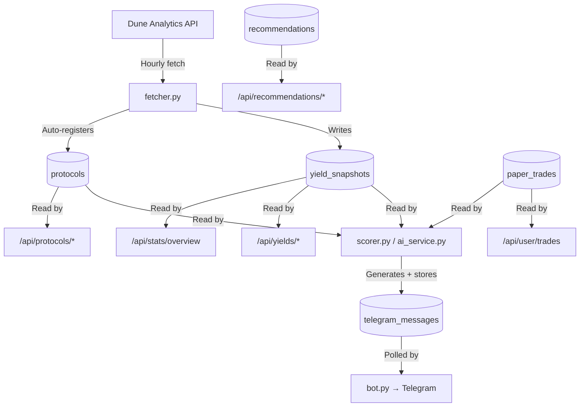

# YieldSage FastAPI Backend — Walkthrough

## What Was Built

A complete REST API layer with **6 routers** and **16 endpoints** that powers the web dashboard, using the exact same database tables the Telegram bot reads from.

---

## Telegram ↔ Web Dashboard Data Sync

> [!IMPORTANT]
> Both the Telegram bot and the web dashboard read from the **exact same Supabase tables**. There is zero data divergence.

### Data Flow Diagram

### The same `yield_snapshots` row that generates a Telegram alert like:
> • clearpool-lending (USDT): **17.50% APY** | TVL: N/A

...is the exact row returned by `GET /api/yields/latest` for the dashboard leaderboard.

---

## Complete Endpoint Map

### Public Endpoints (no auth required)

| Method | Path | Purpose |
|--------|------|---------|
| GET | `/api/yields/latest` | Latest snapshot per active protocol (filterable by `risk_tag`) |
| GET | `/api/yields/leaderboard` | Paginated leaderboard sorted by APY desc |
| GET | `/api/yields/history/{slug}` | Time-series snapshots for one protocol (1–90 days) |
| GET | `/api/protocols` | List all active protocols with latest APY inline |
| GET | `/api/protocols/{slug}` | Protocol detail + 30-point history + latest AI recommendation |
| GET | `/api/recommendations/latest` | Best recommendation per risk tier |
| GET | `/api/recommendations/history` | Paginated full recommendation history with on-chain proof links |
| GET | `/api/stats/overview` | Dashboard headline numbers (protocol count, best APY, etc.) |

### Auth-Protected Endpoints (requires `Authorization: Bearer <supabase_jwt>`)

| Method | Path | Purpose |
|--------|------|---------|
| GET | `/api/user/profile` | Fetch user profile + alert preferences |
| PUT | `/api/user/profile` | Update name / risk preference |
| POST | `/api/user/telegram/connect` | Link Telegram chat_id to web account |
| GET | `/api/user/alerts` | Get alert preference settings |
| PUT | `/api/user/alerts` | Update alert thresholds / active toggle |
| GET | `/api/user/activity` | Recent Telegram messages sent to this user |
| GET | `/api/user/trades` | List paper trades with live P&L |
| POST | `/api/user/trades` | Open new paper trade |
| GET | `/api/user/trades/{id}` | Single trade detail with live P&L |
| PUT | `/api/user/trades/{id}/close` | Close an active trade |
| DELETE | `/api/user/trades/{id}` | Delete a trade record |

---

## Files Created / Modified

### New Files
- [auth.py](file:///c:/Users/Jo$h/Desktop/Visual%20Studio%20Code/Yield-Sage/agent/auth.py) — JWT validation dependency
- [routers/__init__.py](file:///c:/Users/Jo$h/Desktop/Visual%20Studio%20Code/Yield-Sage/agent/routers/__init__.py) — Package init
- [routers/yields.py](file:///c:/Users/Jo$h/Desktop/Visual%20Studio%20Code/Yield-Sage/agent/routers/yields.py) — 3 endpoints
- [routers/protocols.py](file:///c:/Users/Jo$h/Desktop/Visual%20Studio%20Code/Yield-Sage/agent/routers/protocols.py) — 2 endpoints
- [routers/recommendations.py](file:///c:/Users/Jo$h/Desktop/Visual%20Studio%20Code/Yield-Sage/agent/routers/recommendations.py) — 2 endpoints
- [routers/stats.py](file:///c:/Users/Jo$h/Desktop/Visual%20Studio%20Code/Yield-Sage/agent/routers/stats.py) — 1 endpoint
- [routers/user.py](file:///c:/Users/Jo$h/Desktop/Visual%20Studio%20Code/Yield-Sage/agent/routers/user.py) — 6 endpoints
- [routers/paper_trades.py](file:///c:/Users/Jo$h/Desktop/Visual%20Studio%20Code/Yield-Sage/agent/routers/paper_trades.py) — 5 endpoints

### Modified Files
- [main.py](file:///c:/Users/Jo$h/Desktop/Visual%20Studio%20Code/Yield-Sage/agent/main.py) — All routers registered + CORS for Next.js
- [requirements.txt](file:///c:/Users/Jo$h/Desktop/Visual%20Studio%20Code/Yield-Sage/agent/requirements.txt) — Added PyJWT
- [.env.example](file:///c:/Users/Jo$h/Desktop/Visual%20Studio%20Code/Yield-Sage/agent/.env.example) — Documented all env vars

## Schema Validation

All routers were cross-referenced against the live Supabase schema:
- `yield_snapshots.apy` → `double precision` ✅
- `telegram_messages` uses `sent_at` not `created_at` ✅ (fixed)
- `paper_trades` uses `double precision` for amounts ✅
- `recommendations.apy_at_time` → `numeric` ✅
- `protocols.risk_tag` CHECK constraint matches router filters ✅

## Swagger Docs

After deploying, interactive API docs are at `https://<railway-url>/docs`
