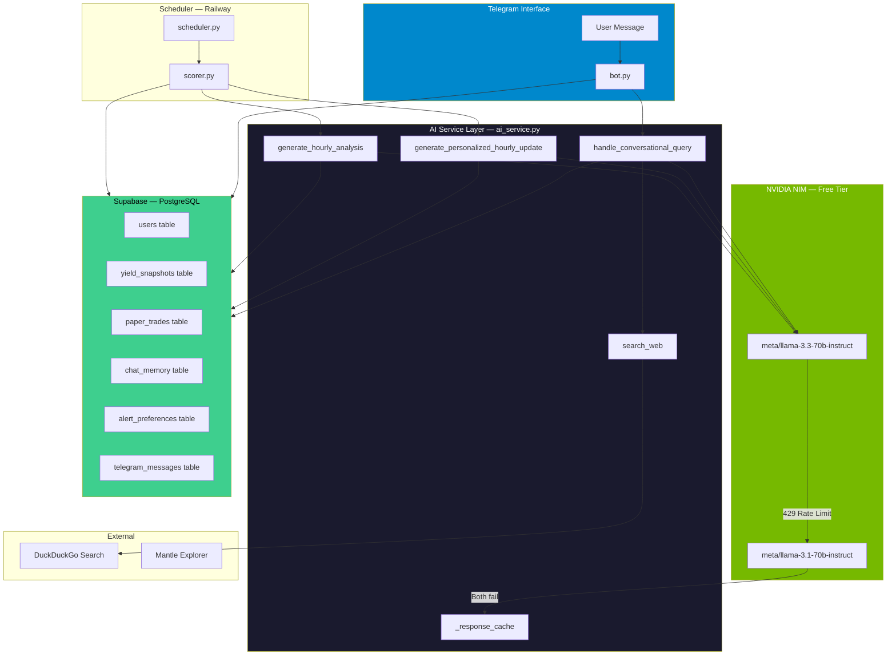
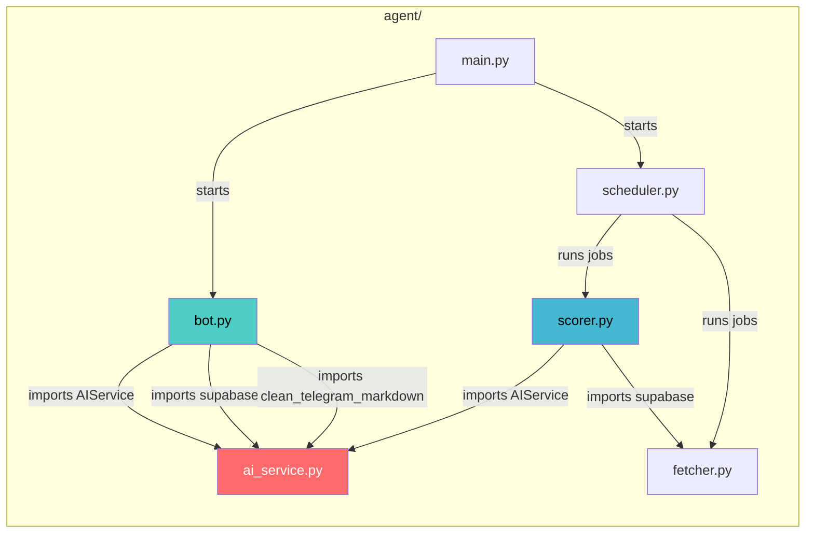
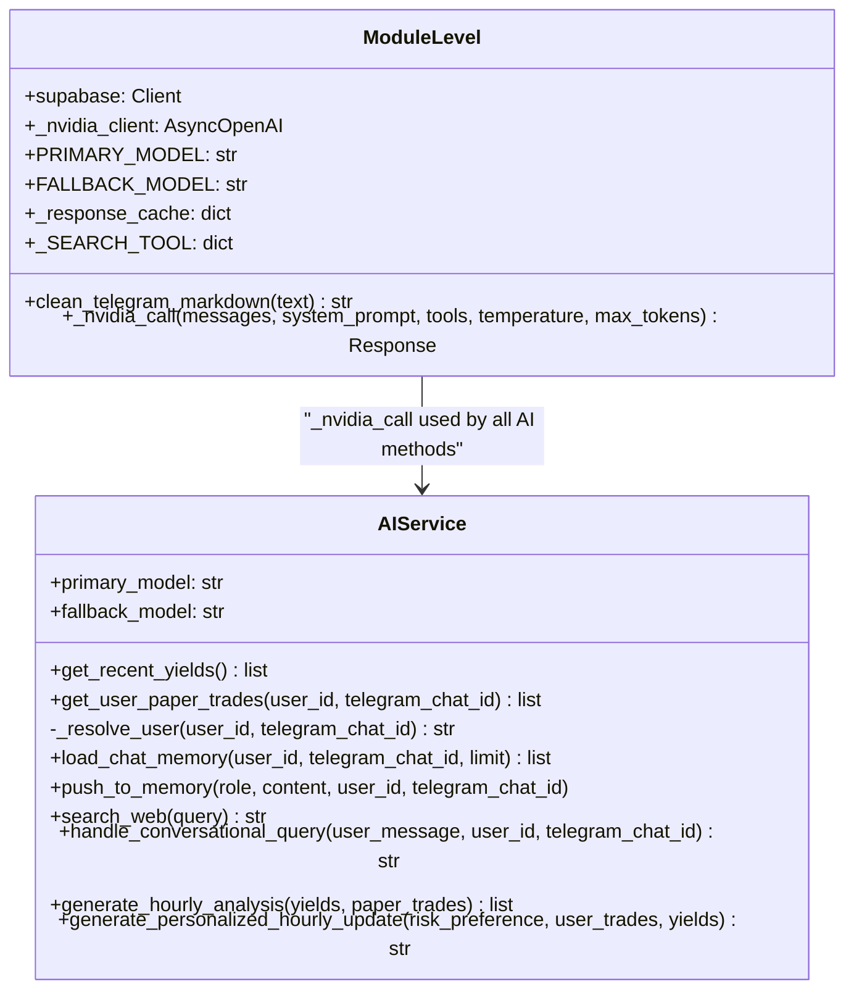
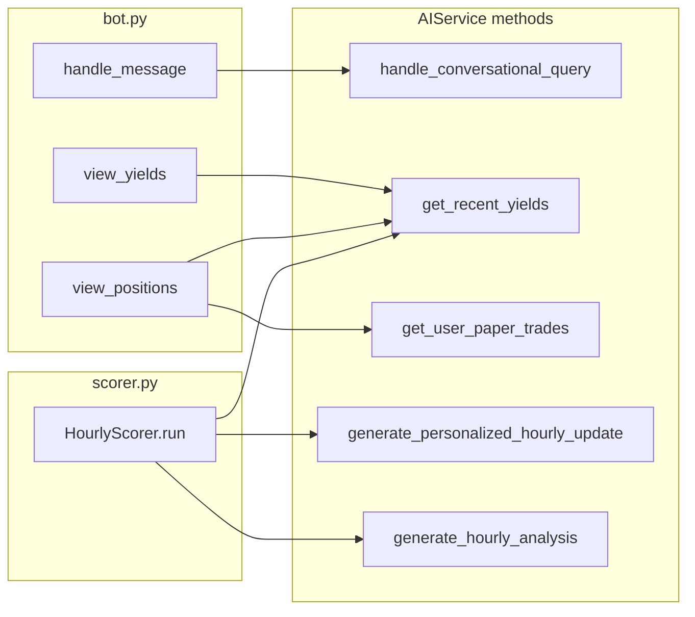
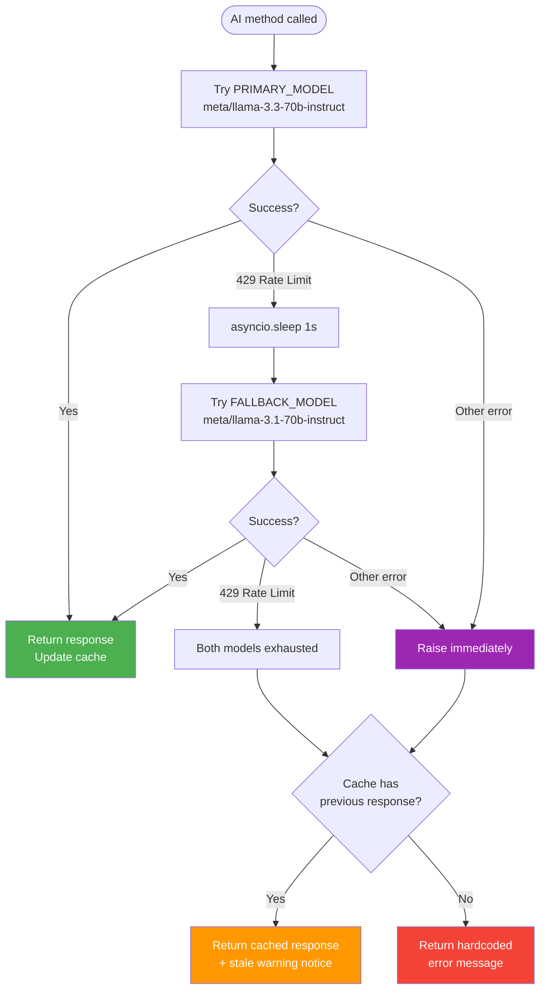
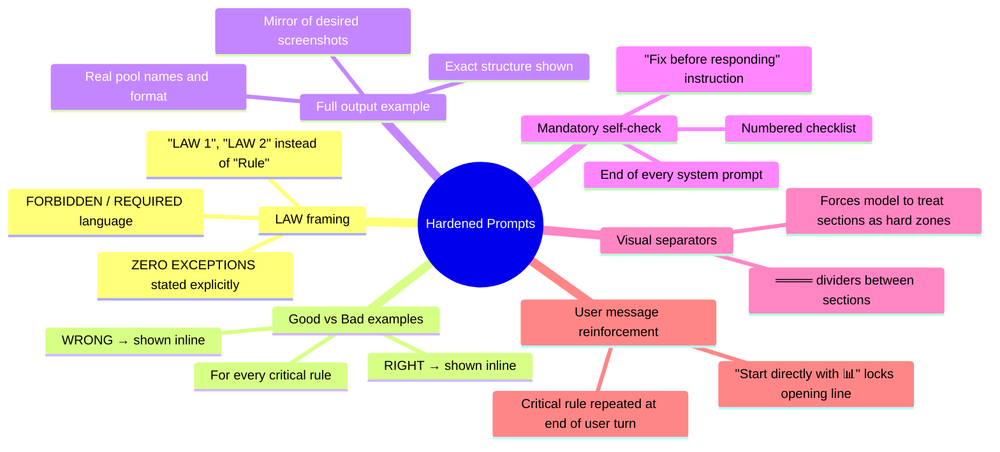
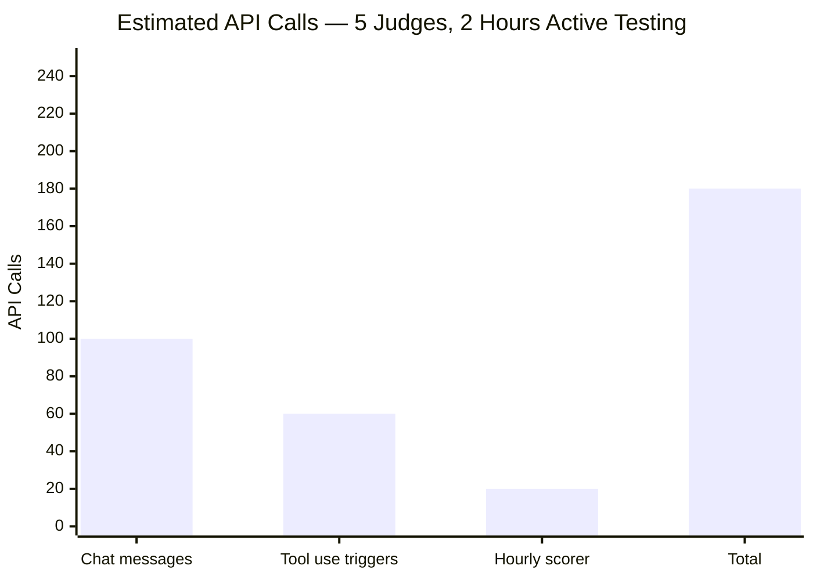
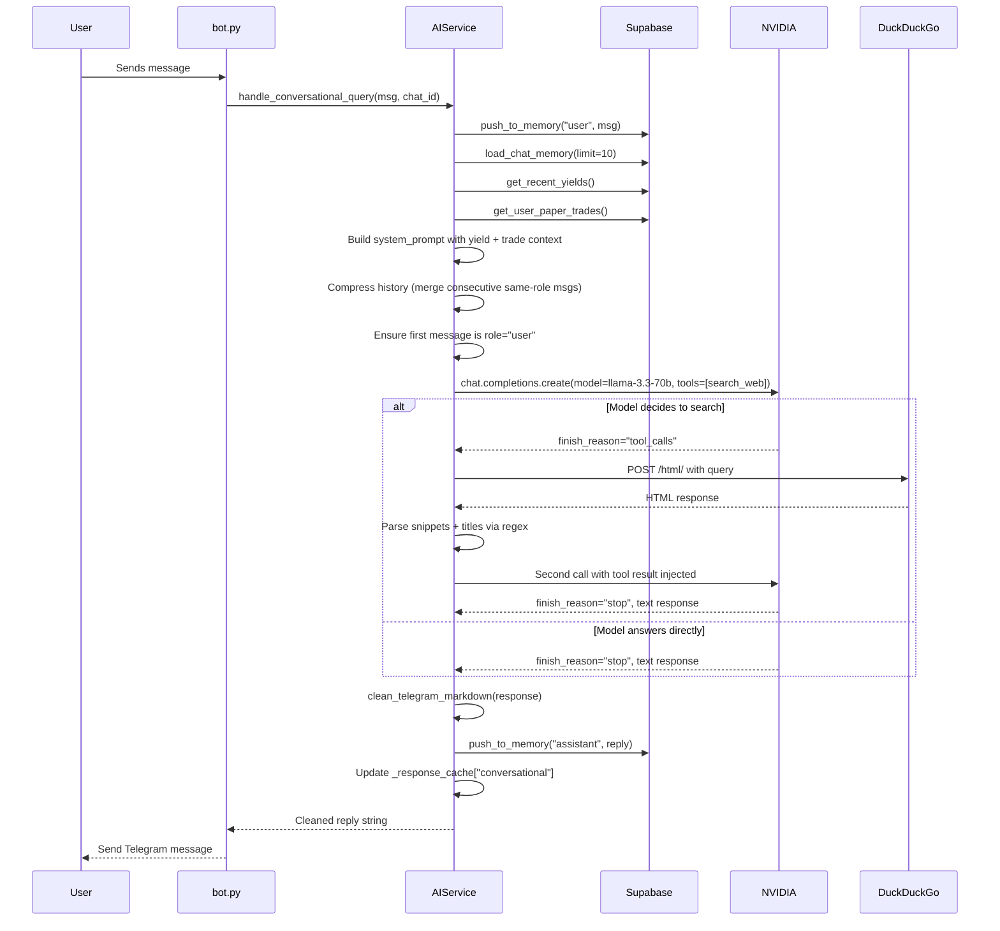
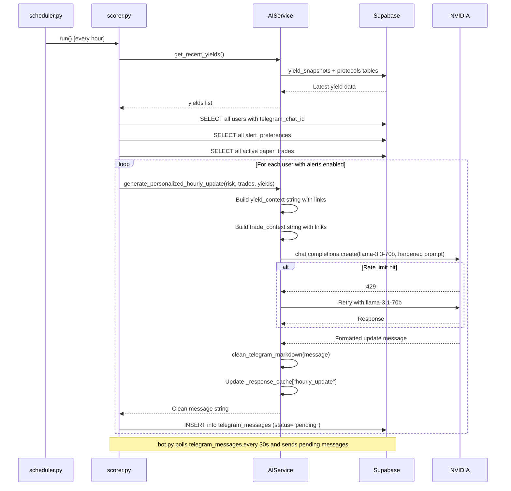
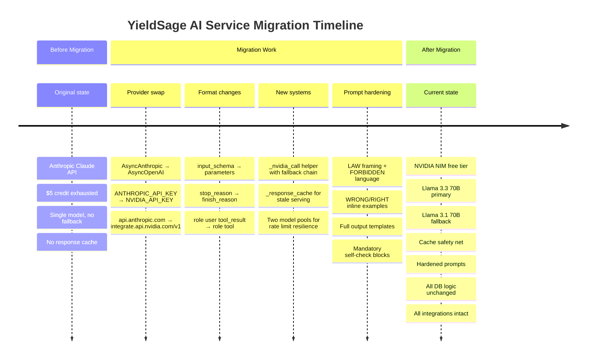

# YieldSage — AI Service Migration Documentation
## Anthropic Claude → NVIDIA NIM (Llama 3.3 70B)

> **Purpose of this document:** A complete, zero-ambiguity reference for any developer or AI coding agent working on this codebase. It covers exactly what changed, why, what stayed the same, how the system works end-to-end, and what to watch out for.

---

## Table of Contents

1. [Context & Why This Migration Happened](#1-context--why-this-migration-happened)
2. [High-Level System Overview](#2-high-level-system-overview)
3. [File Dependency Map](#3-file-dependency-map)
4. [What Changed vs What Stayed the Same](#4-what-changed-vs-what-stayed-the-same)
5. [Provider Comparison: Anthropic vs NVIDIA NIM](#5-provider-comparison-anthropic-vs-nvidia-nim)
6. [API Format Differences (Critical)](#6-api-format-differences-critical)
7. [The New ai_service.py — Architecture](#7-the-new-ai_servicepy--architecture)
8. [Fallback & Caching System](#8-fallback--caching-system)
9. [Hardened Prompt Engineering](#9-hardened-prompt-engineering)
10. [Environment Variables](#10-environment-variables)
11. [requirements.txt Changes](#11-requirementstxt-changes)
12. [Rate Limits & Hackathon Capacity](#12-rate-limits--hackathon-capacity)
13. [Data Flow: Conversational Query](#13-data-flow-conversational-query)
14. [Data Flow: Hourly Scorer](#14-data-flow-hourly-scorer)
15. [Known Differences in Model Behaviour](#15-known-differences-in-model-behaviour)
16. [Rollback Instructions](#16-rollback-instructions)
17. [Quick Reference: Integration Points](#17-quick-reference-integration-points)

---

## 1. Context & Why This Migration Happened

The original `ai_service.py` used **Anthropic's Claude API** (Claude Haiku for conversational queries, Claude Sonnet for scoring and hourly updates). The $5 Anthropic API credit was exhausted during development.

The replacement uses **NVIDIA NIM** — NVIDIA's hosted inference platform at `build.nvidia.com` — which provides a **free tier** with an **OpenAI-compatible API**. This means the client library, request format, and response format all follow the OpenAI specification rather than Anthropic's proprietary format.

**Model chosen:** `meta/llama-3.3-70b-instruct` (primary) with `meta/llama-3.1-70b-instruct` as automatic fallback.

**Why these models:**
- Both are free-tier endpoints on NVIDIA NIM
- Both support OpenAI-format **function/tool calling** — critical for the web search feature
- Llama 3.3 70B has strong instruction-following for structured output tasks
- Two separate models = two independent rate-limit pools for burst resilience

---

## 2. High-Level System Overview



---

## 3. File Dependency Map



### Exact Import Statements That Depend on `ai_service.py`

**`bot.py`:**
```python
from ai_service import AIService, supabase, clean_telegram_markdown
```

**`scorer.py`:**
```python
from ai_service import AIService
```

> ⚠️ **Critical:** These three module-level names — `AIService`, `supabase`, `clean_telegram_markdown` — must always exist at the top level of `ai_service.py`. Renaming or removing any of them will break the imports silently at runtime.

---

## 4. What Changed vs What Stayed the Same

### Changed

| Component | Original | New |
|---|---|---|
| Python import | `from anthropic import AsyncAnthropic` | `from openai import AsyncOpenAI, RateLimitError` |
| Additional import | — | `import asyncio` |
| Client variable | `anthropic = AsyncAnthropic(api_key=...)` | `_nvidia_client = AsyncOpenAI(base_url=..., api_key=...)` |
| API base URL | `api.anthropic.com` | `integrate.api.nvidia.com/v1` |
| Environment variable | `ANTHROPIC_API_KEY` | `NVIDIA_API_KEY` |
| Models | `claude-haiku-4-5-20251001` + `claude-sonnet-4-6` | `meta/llama-3.3-70b-instruct` + `meta/llama-3.1-70b-instruct` |
| `__init__` attributes | `self.haiku_model`, `self.sonnet_model` | `self.primary_model`, `self.fallback_model` |
| Tool definition format | Anthropic `input_schema` | OpenAI `parameters` |
| Response parsing | `response.content[0].text` + block iteration | `response.choices[0].message.content` |
| Tool call detection | `response.stop_reason == "tool_use"` | `response.choices[0].finish_reason == "tool_calls"` |
| Tool result format | `role: "user"` with `type: "tool_result"` content | `role: "tool"` with `tool_call_id` |
| System prompts | Soft rules | Hardened with LAWs, examples, self-check |
| Error handling | Returns hardcoded string immediately | Checks cache first, then returns cached + stale notice |
| Response cache | Does not exist | `_response_cache` dict with 3 keys |
| Core API helper | Inline per method | `_nvidia_call()` module-level function |
| Tool definition location | Inline inside `handle_conversational_query` | Module-level constant `_SEARCH_TOOL` |

### Unchanged — Identical Logic

| Component | Status |
|---|---|
| `supabase` module-level export | ✅ Identical |
| `clean_telegram_markdown` function | ✅ Identical (every regex, every rule) |
| `get_recent_yields()` | ✅ Identical |
| `get_user_paper_trades()` | ✅ Identical |
| `_resolve_user()` | ✅ Identical |
| `load_chat_memory()` | ✅ Identical |
| `push_to_memory()` | ✅ Identical |
| `search_web()` | ✅ Identical (DuckDuckGo, same regex) |
| History compression logic | ✅ Identical |
| All context-building strings | ✅ Identical |
| All Supabase table queries | ✅ Identical |
| All method signatures | ✅ Identical |

---

## 5. Provider Comparison: Anthropic vs NVIDIA NIM


---

## 6. API Format Differences (Critical)

This is the most important section for any developer touching the AI call logic.

### 6.1 Client Initialisation

**Old (Anthropic):**
```python
from anthropic import AsyncAnthropic
anthropic = AsyncAnthropic(api_key=os.getenv("ANTHROPIC_API_KEY"))
```

**New (NVIDIA NIM):**
```python
from openai import AsyncOpenAI
_nvidia_client = AsyncOpenAI(
    base_url="https://integrate.api.nvidia.com/v1",
    api_key=os.getenv("NVIDIA_API_KEY")
)
```

---

### 6.2 Tool Definition Format

**Old (Anthropic):**
```python
tools = [{
    "name": "search_web",
    "description": "...",
    "input_schema": {          # ← Anthropic-specific key
        "type": "object",
        "properties": {
            "query": {"type": "string", "description": "..."}
        },
        "required": ["query"]
    }
}]
```

**New (OpenAI/NVIDIA NIM):**
```python
tools = [{
    "type": "function",        # ← Required wrapper
    "function": {
        "name": "search_web",
        "description": "...",
        "parameters": {        # ← OpenAI-specific key (not input_schema)
            "type": "object",
            "properties": {
                "query": {"type": "string", "description": "..."}
            },
            "required": ["query"]
        }
    }
}]
```

---

### 6.3 API Call Format

**Old (Anthropic):**
```python
response = await anthropic.messages.create(
    model="claude-haiku-4-5-20251001",
    max_tokens=1500,
    system=system_prompt,       # ← system is a separate top-level param
    messages=history,           # ← does NOT include system message
    tools=tools,
    temperature=0.3
)
```

**New (NVIDIA NIM / OpenAI):**
```python
response = await _nvidia_client.chat.completions.create(
    model="meta/llama-3.3-70b-instruct",
    max_tokens=1500,
    messages=[
        {"role": "system", "content": system_prompt},  # ← system is first message
        *history                                         # ← rest of messages follow
    ],
    tools=tools,
    tool_choice="auto",
    temperature=0.3
)
```

---

### 6.4 Response Parsing

**Old (Anthropic):**
```python
# Check if tool was called
if response.stop_reason == "tool_use":
    tool_uses = [b for b in response.content if b.type == "tool_use"]
    for tool_use in tool_uses:
        name  = tool_use.name        # string
        input = tool_use.input       # dict (already parsed)
        id    = tool_use.id          # string

# Get text response
text = response.content[0].text
```

**New (NVIDIA NIM / OpenAI):**
```python
message = response.choices[0].message

# Check if tool was called
if response.choices[0].finish_reason == "tool_calls" and message.tool_calls:
    for tc in message.tool_calls:
        name  = tc.function.name                    # string
        input = json.loads(tc.function.arguments)   # must JSON-parse (it's a string)
        id    = tc.id                               # string

# Get text response
text = response.choices[0].message.content
```

---

### 6.5 Tool Result Format (Multi-turn)

**Old (Anthropic):**
```python
# Tool result goes back as role="user" with typed content blocks
assistant_msg = {
    "role": "assistant",
    "content": response.content   # the full content block list from Anthropic
}
tool_result_msg = {
    "role": "user",               # ← Anthropic: tool results are role "user"
    "content": [{
        "type": "tool_result",    # ← Anthropic-specific type
        "tool_use_id": tool_use.id,
        "content": "result string"
    }]
}
```

**New (NVIDIA NIM / OpenAI):**
```python
# Tool result goes back as role="tool" — a dedicated role
assistant_msg = {
    "role": "assistant",
    "content": message.content or "",
    "tool_calls": [{              # ← must be serialised manually
        "id": tc.id,
        "type": "function",
        "function": {
            "name": tc.function.name,
            "arguments": tc.function.arguments  # keep as string
        }
    } for tc in message.tool_calls]
}
tool_result_msg = {
    "role": "tool",               # ← OpenAI: dedicated "tool" role
    "tool_call_id": tc.id,        # ← references the tool call by ID
    "content": "result string"
}
```

---

## 7. The New ai_service.py — Architecture



### Method Call Origins



---

## 8. Fallback & Caching System

This is a completely new addition that did not exist in the original.



### Cache Keys

```python
_response_cache = {
    "conversational": None,   # Last reply from handle_conversational_query()
    "hourly_analysis": None,  # Last JSON list from generate_hourly_analysis()
    "hourly_update":   None,  # Last string from generate_personalized_hourly_update()
}
```

Cache is in-memory only. It resets if the Railway process restarts. It is populated on every successful AI call and read only when both models are unavailable.

---

## 9. Hardened Prompt Engineering

The three system prompts were redesigned using a strict prompt engineering approach specifically tuned for Llama 3.3 70B's instruction-following behaviour.

### Why Hardening Was Needed

Claude (Haiku/Sonnet) is extremely instruction-obedient. Llama 3.3 70B is capable but less consistent — it may occasionally:
- Emit `#` Markdown headers despite being told not to
- Use `| table |` syntax instead of bullet lists
- Skip the `[name](url)` link format for pool names
- Add preamble text before the expected output structure

The hardened prompts compensate for this with explicit examples, authoritative framing, and a mandatory self-check step.

### Techniques Used



### Per-Method Prompt Strategy

| Method | Key Addition |
|---|---|
| `handle_conversational_query` | Full formatted example response showing exact link + bold style |
| `generate_hourly_analysis` | `WRONG OUTPUT` / `CORRECT OUTPUT` blocks; starts-with-`[` / ends-with-`]` rule |
| `generate_personalized_hourly_update` | Complete example matching real screenshots; user message ends with exact opening instruction |

---

## 10. Environment Variables

### Original `.env` / Railway variables needed:

```env
# Supabase
SUPABASE_URL=https://your-project.supabase.co
SUPABASE_SERVICE_ROLE_KEY=your-service-role-key

# Telegram
TELEGRAM_BOT_TOKEN=your-bot-token

# Mantle
MANTLE_RPC_URL=https://rpc.mantle.xyz
YIELDSAGE_WALLET_PRIVATE_KEY=your-wallet-key

# App
NEXT_PUBLIC_APP_URL=https://yieldsage.xyz
AGENT_API_SECRET=your-secret
```

### What changed:

```env
# REMOVE this:
ANTHROPIC_API_KEY=sk-ant-...

# ADD this:
NVIDIA_API_KEY=nvapi-...
```

> ✅ `NVIDIA_API_KEY` is already configured in Railway environment variables and local `.env`.
> The key begins with `nvapi-`.

---

## 11. requirements.txt Changes

```diff
- anthropic
+ openai>=1.0.0
```

All other dependencies remain unchanged. Run locally:
```bash
pip install openai>=1.0.0 --break-system-packages
```

---

## 12. Rate Limits & Hackathon Capacity

### NVIDIA NIM Free Tier (approximate — verify in dashboard)

| Model | RPM | RPD |
|---|---|---|
| `meta/llama-3.3-70b-instruct` | ~40 | ~1,000 |
| `meta/llama-3.1-70b-instruct` | ~40 | ~1,000 |
| **Combined (with fallback)** | ~80 burst | ~2,000 |

### Hackathon Usage Estimate



| Source | Estimate | Calls |
|---|---|---|
| 5 judges × 20 chat messages | 1 call per message | 100 |
| ~60% trigger web search | +1 call each | 60 |
| Hourly scorer × 10 users × 2 hours | 1 call per user per run | 20 |
| **Total** | | **~180 calls** |

180 calls is well within the 2,000 combined daily limit. The system is safe for extended hackathon judge usage.

---

## 13. Data Flow: Conversational Query



---

## 14. Data Flow: Hourly Scorer



---

## 15. Known Differences in Model Behaviour

These are honest differences to be aware of when testing:

| Behaviour | Claude (original) | Llama 3.3 70B (new) |
|---|---|---|
| Formatting instruction compliance | Near-perfect | Good, but may slip occasionally |
| Link format consistency | Always `[name](url)` | Mostly consistent; hardened prompts improve this |
| JSON output (scoring) | Clean JSON, rarely needs stripping | Usually clean; code fence stripping still runs |
| Response personality | Warm, concise, Claude-like | Slightly different tone; still helpful |
| Tool call triggering | Reliable | Slightly less aggressive at deciding to search |
| Chat history continuation | Seamless | Continues from same chat_memory table — no loss |
| Accumulated "learning" | None — stateless | None — stateless (same as Claude) |

> **Important clarification:** Neither Claude nor Llama "learns" from user conversations over time. Both are stateless LLMs. The only memory either model has is what is explicitly loaded from the `chat_memory` Supabase table and injected into each prompt. This is identical in both versions. No historical intelligence is lost in this migration.

---

## 16. Rollback Instructions

A copy of the original `ai_service.py` (Anthropic-based) is preserved separately.

To roll back:

1. Replace the current `agent/ai_service.py` with the original copy
2. Restore `ANTHROPIC_API_KEY` in Railway environment variables
3. Add `anthropic` back to `requirements.txt` and remove `openai>=1.0.0`
4. Redeploy on Railway

No database changes, no schema changes, no other files need to be touched. The rollback is a single file swap.

---

## 17. Quick Reference: Integration Points

For any coding agent working in this repo — these are the exact touch points:

### What `bot.py` uses from `ai_service.py`

```python
from ai_service import AIService, supabase, clean_telegram_markdown

ai = AIService()

# In handle_message():
reply = await ai.handle_conversational_query(user_msg, telegram_chat_id=chat_id)

# In view_yields(), start_trade_flow(), view_positions():
yields = await ai.get_recent_yields()

# In view_positions():
trades = await ai.get_user_paper_trades(telegram_chat_id=chat_id)

# In handle_message() and everywhere sending messages:
cleaned = clean_telegram_markdown(text)

# Direct Supabase access (bot.py uses supabase directly):
supabase.table("users").select(...)
supabase.table("paper_trades").update(...)
# etc.
```

### What `scorer.py` uses from `ai_service.py`

```python
from ai_service import AIService

scorer = AIService()

yields = await scorer.get_recent_yields()
msg = await scorer.generate_personalized_hourly_update(
    risk_preference=risk_preference,
    user_trades=user_trades,
    yields=yields
)
```

### Method Signatures (never change these)

```python
async def handle_conversational_query(
    self,
    user_message: str,
    user_id: str = None,
    telegram_chat_id: int = None
) -> str

async def get_recent_yields(self) -> list

async def get_user_paper_trades(
    self,
    user_id: str = None,
    telegram_chat_id: int = None
) -> list

async def generate_personalized_hourly_update(
    self,
    risk_preference: str,
    user_trades: list,
    yields: list
) -> str

async def generate_hourly_analysis(
    self,
    yields: list,
    paper_trades: list
) -> list
```

---

## Summary



---

*Covers: migration from Anthropic Claude `agent\anthropic_ai_service.py` to NVIDIA NIM `agent/ai_service.py`*
