# YieldSage API Documentation

This document describes all endpoints, query parameters, request-response schemas, and authentication requirements for the YieldSage FastAPI REST API.

---

## 1. Request Lifecycle & Authentication Flow

API requests are categorized into two types:
1. **Public Endpoints**: Open to all client queries, no authorization token required.

```mermaid
sequenceDiagram
    autonumber
    actor Client as Frontend Client
    participant Auth as Supabase Auth
    participant API as FastAPI Backend (agent/auth.py)
    participant DB as Supabase PostgreSQL
    
    rect rgb(20, 20, 20)
        Note over Client,Auth: Authentication (Protected Routes Only)
        Client->>Auth: Login / Signup Request
        Auth-->>Client: Return Session JWT Token
    end
    
    Client->>API: HTTP Request (Headers: Authorization: Bearer JWT)
    Note over API: Extract JWT & Validate Signature
    
    alt JWT is invalid / expired
        API-->>Client: HTTP 401 Unauthorized
    else JWT is valid
        API->>DB: Query User Profile & Data (scoped via auth.uid())
        DB-->>API: Return Scoped Query Rows
        API-->>Client: HTTP 200 OK + JSON Payload
    end
```

2. **Protected Endpoints**: Requires a Bearer JWT issued by Supabase Auth in the request headers (`Authorization: Bearer <supabase_jwt>`). The FastAPI app validates the JWT signature to authenticate the user.



---

## 2. API Endpoints Map

### 2.1 Public Stats & Metadata

#### `GET /api/stats/overview`
Returns headline numbers for the dashboard stats card section.
- **Query Parameters**: None
- **Response Schema (`200 OK`)**:
  ```json
  {
    "protocols_tracked": 12,
    "pools_tracked": 15,
    "total_tvl": 314070000.0,
    "average_apy": 14.82,
    "median_apy": 12.05,
    "total_snapshots": 14502,
    "best_apy": 121.40,
    "active_paper_trades": 8,
    "recommendations_generated": 420,
    "recommendations_on_chain": 420,
    "last_data_refresh": "2026-06-03T08:00:00Z",
    "timestamp": "2026-06-03T08:30:00Z"
  }
  ```

---

### 2.2 Yield Snapshot Leaderboard

#### `GET /api/yields/latest`
Returns the most recent yield snapshot for every active protocol pool.
- **Query Parameters**:
  - `risk_tag` (string, optional): Filter by risk profile: `stable` | `moderate` | `aggressive`.
  - `limit` (integer, optional): Maximum number of entries to return (default: `50`).
- **Response Schema (`200 OK`)**:
  ```json
  {
    "data": [
      {
        "id": "e9c1db17-8e6c-4861-8289-e12ba81512db",
        "protocol_id": "a9a3b901-526b-4e12-b91c-132d0f5ee8cb",
        "asset": "USDT",
        "apy": 17.50,
        "base_apy": 12.00,
        "reward_apy": 5.50,
        "tvl_usd": 2100000.0,
        "reward_tokens": "MNT",
        "fetched_at": "2026-06-03T08:00:00Z",
        "protocol": {
          "id": "a9a3b901-526b-4e12-b91c-132d0f5ee8cb",
          "name": "Clearpool Lending",
          "pool_name": "USDT",
          "pool_address": "0x123...",
          "risk_tag": "stable"
        }
      }
    ],
    "count": 1,
    "timestamp": "2026-06-03T08:30:00Z"
  }
  ```

#### `GET /api/yields/leaderboard`
Paginated leaderboard list of active pools, ranked by `tvl_usd` descending.
- **Query Parameters**:
  - `risk_tag` (string, optional): Filter by `stable` | `moderate` | `aggressive`.
  - `search` (string, optional): Search query matching protocol name, pool name, or asset.
  - `min_tvl` (float, optional): Filter out pools with TVL below this value.
  - `min_apy` (float, optional): Filter out pools with APY below this value.
  - `page` (integer, optional): Page number (default: `1`).
  - `page_size` (integer, optional): Items per page (default: `20`).
- **Response Schema (`200 OK`)**:
  ```json
  {
    "data": [...],
    "total": 15,
    "page": 1,
    "page_size": 20,
    "total_pages": 1
  }
  ```

#### `GET /api/yields/history/{slug}`
Returns hourly historical yield snapshots for a protocol pool.
- **Path Parameters**:
  - `slug` (string, required): The protocol pool slug.
- **Query Parameters**:
  - `days` (integer, optional): Number of historical days to return (default: `30`, range: `1-90`).
- **Response Schema (`200 OK`)**:
  ```json
  {
    "protocol": {
      "id": "...",
      "slug": "clearpool-usdt",
      "name": "Clearpool Lending",
      "pool_name": "USDT"
    },
    "days": 30,
    "data": [
      {
        "apy": 17.50,
        "base_apy": 12.00,
        "reward_apy": 5.50,
        "tvl_usd": 2100000.0,
        "fetched_at": "2026-06-03T08:00:00Z"
      }
    ],
    "count": 1
  }
  ```

---

### 2.3 Protocol Metadata

#### `GET /api/protocols`
Lists all active protocols along with their latest APY snapshots inline.
- **Query Parameters**:
  - `risk_tag` (string, optional): Filter by risk level.
  - `include_inactive` (boolean, optional): Return inactive metadata records (default: `false`).
- **Response Schema (`200 OK`)**:
  ```json
  {
    "data": [
      {
        "id": "...",
        "slug": "...",
        "name": "...",
        "pool_name": "...",
        "latest_snapshot": { ... }
      }
    ],
    "count": 12
  }
  ```

---

### 2.4 AI Recommendations

#### `GET /api/recommendations/latest`
Gets the single highest-ranked active AI recommendation for each risk tier.
- **Response Schema (`200 OK`)**:
  ```json
  {
    "stable": {
      "id": "...",
      "rank": 1,
      "risk_tag": "stable",
      "apy_at_time": 17.50,
      "ai_reasoning": "Clearpool USDT offers premium yields with stable coin constraints...",
      "on_chain_tx_hash": "0xabc...",
      "created_at": "2026-06-03T06:00:00Z",
      "protocol": { "name": "Clearpool Lending", "pool_name": "USDT" }
    },
    "moderate": { ... },
    "aggressive": { ... }
  }
  ```

---

### 2.5 User Paper Trading & Alerts (Protected)

All endpoints in this section require `Authorization: Bearer <supabase_jwt>`.

#### `GET /api/user/trades`
Retrieves all active simulated paper trades for the authenticated user, complete with estimated profit calculations.
- **Response Schema (`200 OK`)**:
  ```json
  [
    {
      "id": "3c02eb92-0b29-4d2c-811c-d102ab3c40ee",
      "user_id": "...",
      "protocol_id": "...",
      "simulated_investment_usd": 1000.00,
      "entry_apy": 17.50,
      "status": "active",
      "created_at": "2026-06-02T08:00:00Z",
      "protocols": {
        "name": "Clearpool Lending",
        "pool_name": "USDT",
        "pool_address": "0x123..."
      }
    }
  ]
  ```

#### `POST /api/user/trades`
Simulates opening a new yield-bearing paper trade position.
- **Request Body**:
  ```json
  {
    "protocol_id": "a9a3b901-526b-4e12-b91c-132d0f5ee8cb",
    "simulated_investment_usd": 1000.00
  }
  ```
- **Response Schema (`200 OK`)**:
  ```json
  {
    "message": "Paper trade simulated successfully",
    "trade_id": "3c02eb92-0b29-4d2c-811c-d102ab3c40ee"
  }
  ```

#### `PUT /api/user/trades/{id}/close`
Closes an active simulated trade position, locking in its accumulated accrued yield.
- **Path Parameters**:
  - `id` (uuid, required): The ID of the paper trade to close.
- **Response Schema (`200 OK`)**:
  ```json
  {
    "message": "Paper trade closed successfully",
    "final_value": 1000.48,
    "profit_usd": 0.48
  }
  ```
