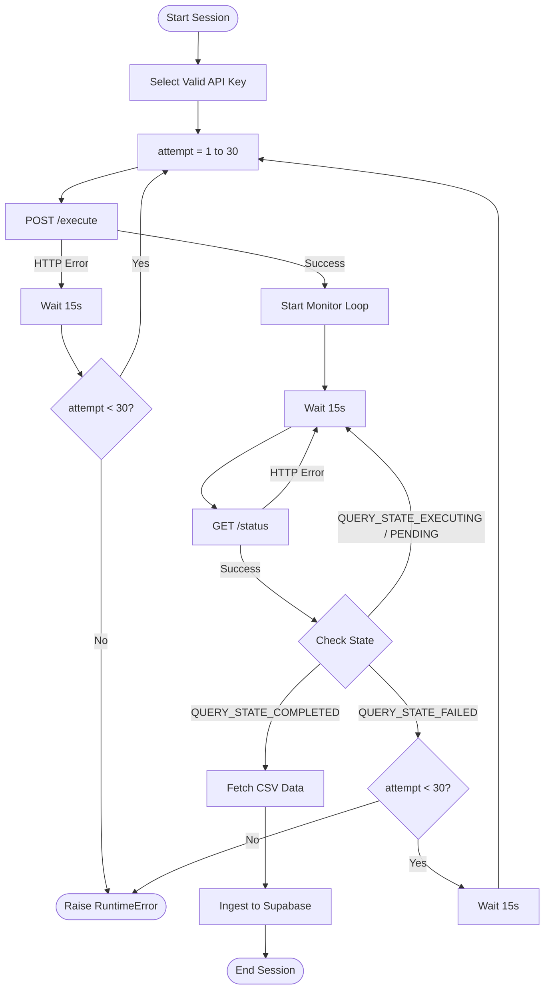
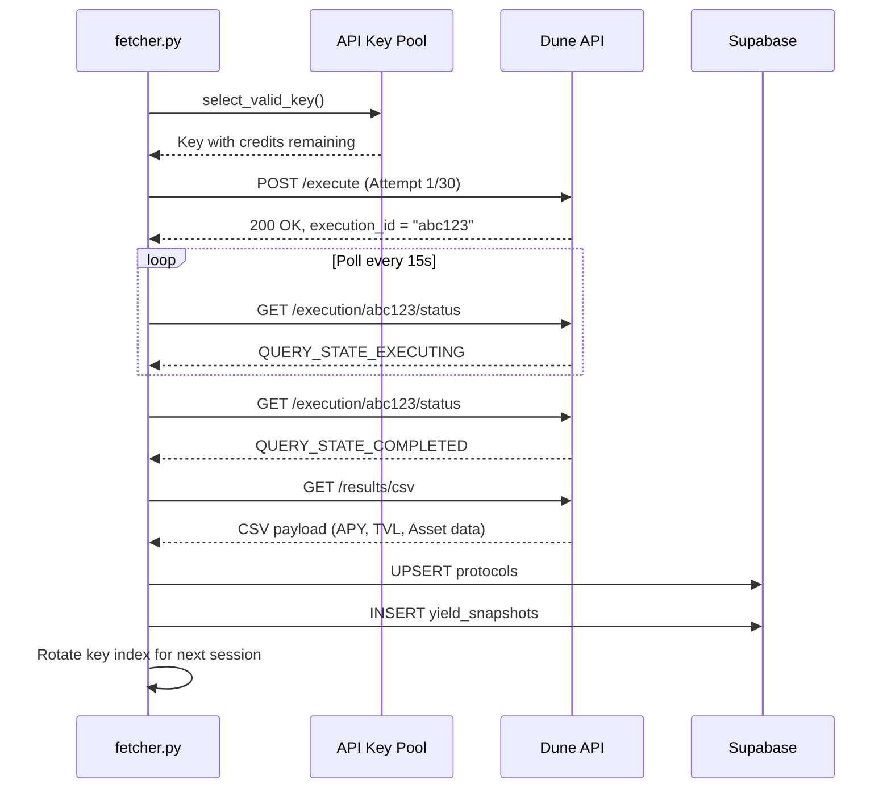
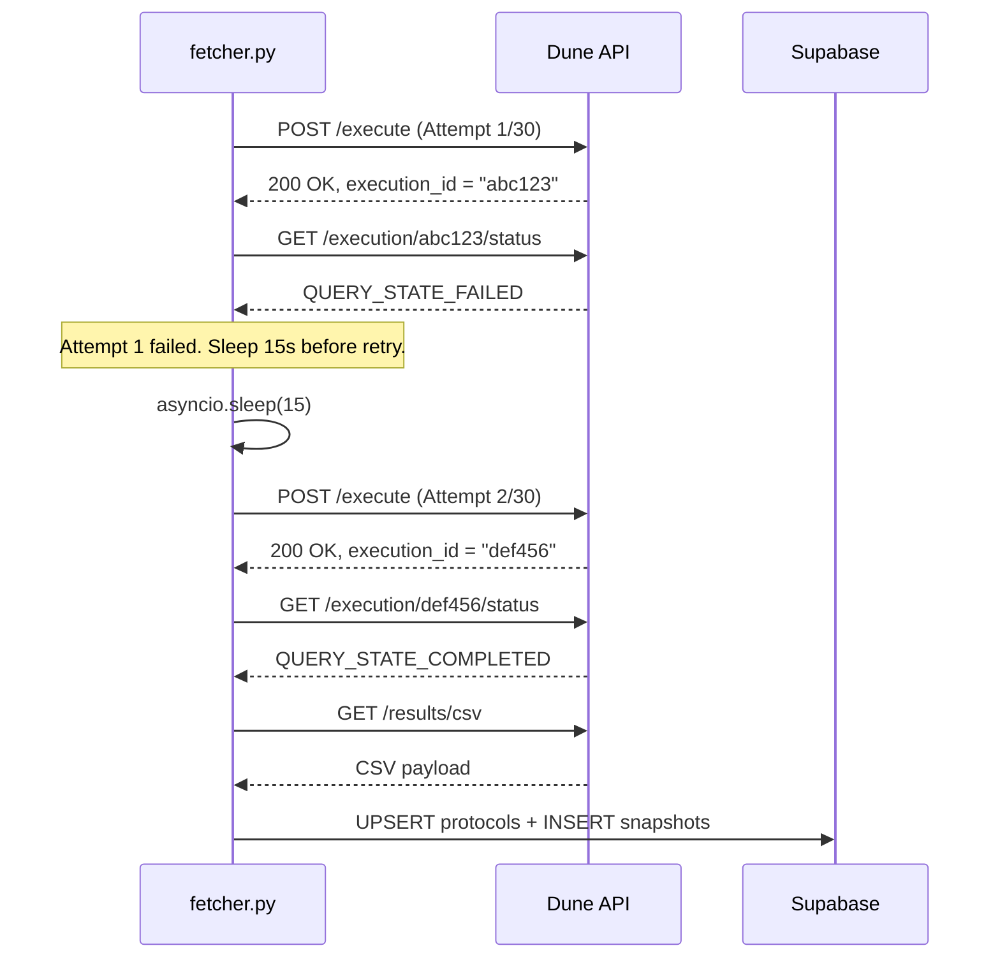
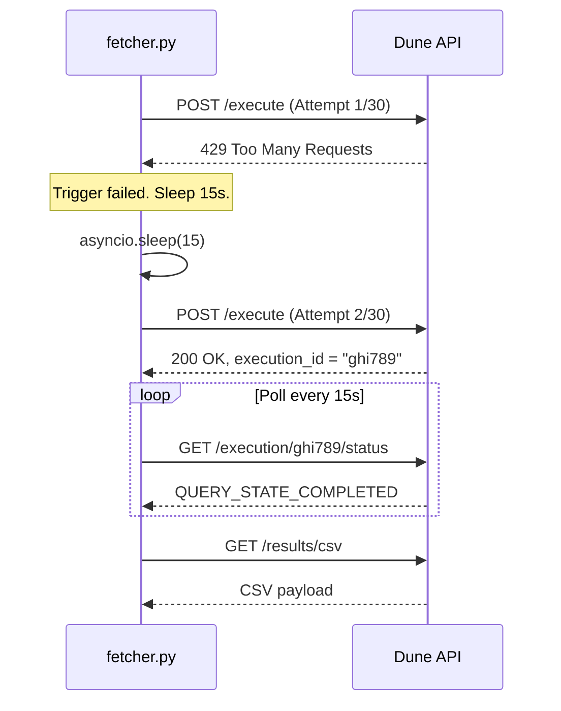
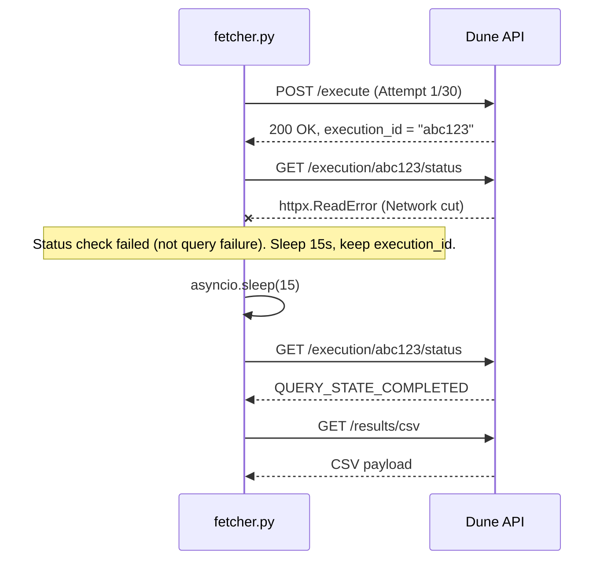
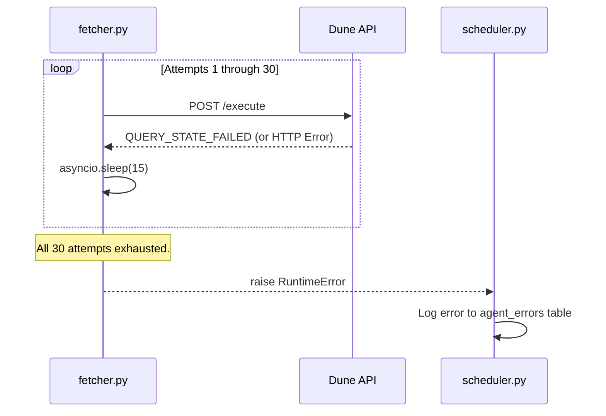

# Dune Fetcher Retry Architecture

This document explains the robust retry mechanism implemented in `agent/fetcher.py` to handle transient failures and rate limits when interacting with the Dune Analytics API.

## How It Works

The Dune fetcher uses a nested loop approach to ensure maximum resilience when pulling yield data.

1. **API Key Rotation**: The fetcher first checks all available API keys and selects one that has remaining execution credits.
2. **Outer Loop (Execution Trigger)**: It attempts to trigger the Dune query up to `max_retries` (currently 30) times.
3. **Inner Loop (Status Polling)**: Once execution successfully starts, it polls Dune every 15 seconds to check the status.
   - If the query succeeds (`QUERY_STATE_COMPLETED`), the loop terminates and results are fetched.
   - If the query fails (`QUERY_STATE_FAILED`), the system aborts the inner loop, waits 15 seconds, and triggers a brand new execution attempt (incrementing the outer loop counter).
   - If the polling request itself fails (network error), it just waits 15 seconds and tries polling again without losing the execution session.

## Architecture Flowchart

## Why 30 Retries?

Increasing `max_retries` to 30 provides excellent resilience against Dune's unpredictable query drops. 

Because we wait 15 seconds between failures, 30 retries gives the system **at least 2.5 minutes** to recover from a complete Dune outage or persistent rate-limiting block before giving up and crashing the scheduled job. This ensures that transient network hiccups or temporary Dune database overloads do not result in missing a critical hourly yield snapshot.

---

## Comprehensive Fetcher Scenarios

The diagrams below illustrate every path `fetcher.py` can take when interacting with the Dune Analytics API, and what happens at each decision point.

### Scenario A: Happy Path (First Attempt Succeeds)

The most common case. Dune is healthy, the query executes on the first try.

### Scenario B: Query Fails, Retry Succeeds

Dune accepts the execution but internally drops it (database overload, resource contention). The fetcher detects `QUERY_STATE_FAILED`, sleeps 15s, and re-triggers.

### Scenario C: Execution Trigger HTTP Error

Dune's `/execute` endpoint itself returns an HTTP error (e.g., 429 rate limit, 500 server error). The fetcher never gets an `execution_id`, so it sleeps 15s and retries the POST.

### Scenario D: Network Error During Polling

The execution is running on Dune, but a transient network issue (packet loss, DNS timeout) causes the status check to fail. The fetcher does **not** abandon the execution — it keeps the same `execution_id` and retries the poll.

### Scenario E: All 30 Attempts Exhausted

Dune is in a prolonged outage. Every single attempt over ~2.5 minutes fails. The fetcher gives up and raises a `RuntimeError`, which is caught by `scheduler.py` and logged to the `agent_errors` table.

### Key Design Decisions

| Decision | Rationale |
|----------|-----------|
| **15s sleep between retries** | Matches Dune's own recommended polling interval. Avoids triggering additional rate limits while still recovering quickly. |
| **30 max retries** | Provides ~2.5 min recovery window. Long enough to survive a Dune deploy or brief outage, short enough to not block the scheduler indefinitely. |
| **Separate handling for poll errors vs query failures** | A network blip during polling does NOT mean the query failed on Dune — the execution may still be running. So we keep the same `execution_id` and retry the poll. A `QUERY_STATE_FAILED` response means Dune explicitly killed the query, so we must start a fresh execution. |
| **Key rotation after success** | After a successful session, `fetcher.py` rotates to the next API key for the *next* hourly run. This distributes credit consumption evenly across all keys. |

