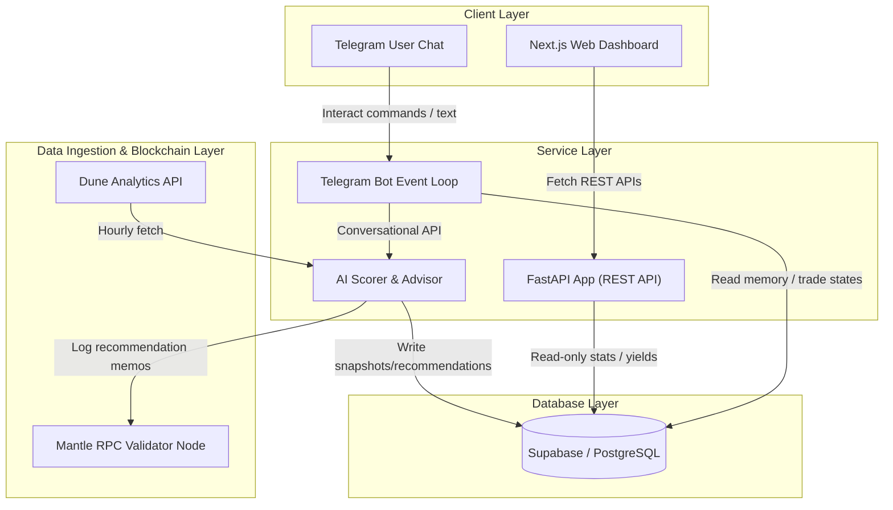
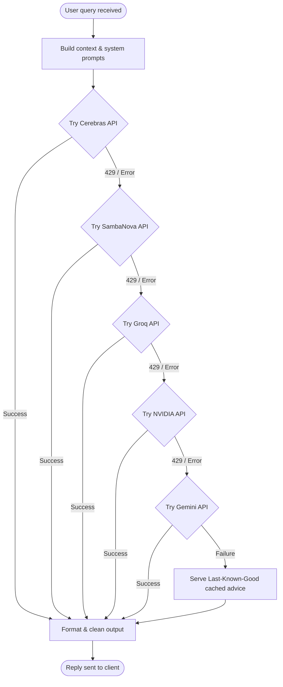
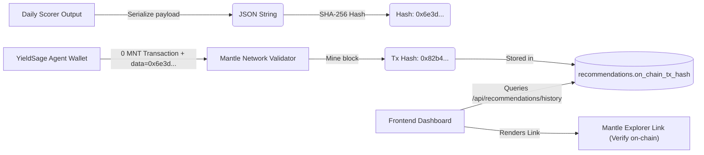

# YieldSage System Architecture

This document describes the high-level system architecture, data topology, and service integrations of the YieldSage yield intelligence agent on the Mantle Network.

---

## 1. Architectural Overview

YieldSage is structured as a decoupled, multi-tier system designed to ensure high performance, fault tolerance, and absolute data consistency. The architecture is split into three core layers:

1. **Data Ingestion & Agent Layer (Python Backend)**: 
   - **Dune Fetcher**: Periodically execution-triggers and pulls yield metrics from Dune Analytics.
   - **AI Scorer / Advisor Service**: Interacts with the LLM cascade (Cerebras, SambaNova, Groq, NVIDIA, Gemini) to score pools and formulate plain-English advice.
   - **Telegram Bot**: Processes queries, handles paper trade simulations with direct parameter parsing, and broadcasts hourly yield alerts.
   - **FastAPI REST API**: Serving the web application.

2. **Database Layer (Supabase / PostgreSQL)**:
   - Houses structural schemas, user profile preferences, alerts, paper trades, yield snapshots, and recommendations. Actively enforces Row Level Security (RLS).

3. **Client Layer (Next.js & Telegram)**:
   - **Next.js Web Dashboard**: Highly-optimized dark-mode React interface for yield monitoring, charts, and simulated trading.
   - **Telegram Chat**: Interactive bot for real-time alerts, prompt shortcuts, and natural language advisory queries.

### High-Level Component Interactions

---

## 2. Ingestion & Sync Topology

The ingestion process runs hourly, pulling structured pool statistics directly from Dune. The data is processed composite-key style (grouped by `(Protocol, Pool Address)`) to handle protocols that have multiple pools on the same contract or distinct asset groups.

### Ingestion Flow Diagram

```mermaid
sequenceDiagram
    autonumber
    participant D as Dune Analytics API
    participant F as Dune Fetcher (agent/fetcher.py)
    participant DB as Supabase Database
    
    F->>D: POST /query/{query_id}/execute (using active credentials key)
    D-->>F: Return execution_id
    loop Every 15 seconds
        F->>D: GET /execution/{execution_id}/status
        D-->>F: Return Status (PENDING/COMPLETED)
    end
    F->>D: GET /query/{query_id}/results/csv
    D-->>F: Return CSV Data Stream
    
    Note over F,DB: Composite Key Analysis: (protocol_name, pool_address)
    F->>DB: SELECT id, name, pool_address FROM protocols
    DB-->>F: Return existing protocols list
    
    rect rgb(20, 20, 20)
        Note over F: Deduplicate & register new protocols (if missing)
        F->>DB: INSERT INTO protocols (new records)
    end
    
    F->>DB: INSERT INTO yield_snapshots (APY, TVL, Base APY, Reward APY, etc.)
    DB-->>F: Acknowledge writes
```

---

## 3. Multi-LLM Cascading Architecture

To guarantee 100% service uptime for real-time Telegram queries and background scoring tasks, YieldSage implements a **Cascading Fallback Routing** algorithm across multiple independent LLM providers. If a provider throws a `RateLimitError` (HTTP 429) or other API exceptions, the engine immediately cascades down to the next provider.

### Realtime User Query Routing Priority

1. **Cerebras** (`gpt-oss-120b` ➛ `zai-glm-4.7`)
2. **SambaNova** (`Meta-Llama-3.3-70B-Instruct` ➛ `gemma-3-12b-it`)
3. **Groq** (`llama-3-3-70b-versatile`)
4. **NVIDIA** (`meta/llama-3.3-70b-instruct` ➛ `meta/llama-3.1-70b-instruct`)
5. **Gemini** (`gemini-2.5-flash-lite` ➛ `gemini-2.5-flash`)

For background tasks (such as hourly scoring of paper trades), the priority order is rearranged to route through **NVIDIA** and **Gemini** first, reserving Cerebras/SambaNova high-speed slots for interactive user chats.

### Cascade Control Sequence

---

## 4. On-Chain Verifiability Layer

To establish trust and verify that the AI agent's recommendations are real, directional, and tamper-proof, every daily recommendation batch is cryptographically logged on the Mantle Network.

1. **Hash Generation**: A SHA-256 hash is computed from the daily recommendation payload (timestamp, ranking order, risk tiers, and recommended APYs).
2. **On-Chain Log**: The agent triggers a 0-value transaction to its own wallet address, appending the SHA-256 hash as hexadecimal data in the transaction `data` (memo) field.
3. **Proof Verification**: The dashboard reads the transaction hash from the database, rendering a direct link to the transaction on the Mantle Explorer.

---

## 5. Network & Deployment Topology

- **Web Frontend (Vercel)**: Next.js 14 static-optimized client files communicating over secure HTTPS to the backend APIs. Uses React Query for client caching and polling.
- **Backend Services (Railway)**: Dockerized Python environment running three processes:
  1. `web` (FastAPI REST server serving requests on port 8000 via Uvicorn).
  2. `worker` (APScheduler cron jobs running data fetches hourly and recommendations daily).
  3. `bot` (Telegram async event loop processing long-poll messages).
- **Database (Supabase)**: Multi-region PostgreSQL DB with strict Row Level Security (RLS) policies.

---

## 6. Zero-Friction Paper Trading Flow

To make paper trading simulations seamless, YieldSage integrates the Next.js Pro Dashboard with the Telegram AI Agent:

1. **Dashboard Prompt**: When a user clicks **Simulate** on a pool in the web interface, a modal prompts them for a USD investment amount.
2. **Prefilled Command Redirect**: Clicking **Approve** redirects the user to Telegram with a pre-filled deep-link command: `/trade address=<pool_address> amount=<amount> token=<pool_name>`.
3. **Instant Simulation**: The Telegram Bot parses these parameters directly, matches the protocol in the database, grabs the latest APY snapshot, and instantly simulates the trade, skipping the manual interactive configuration steps.
