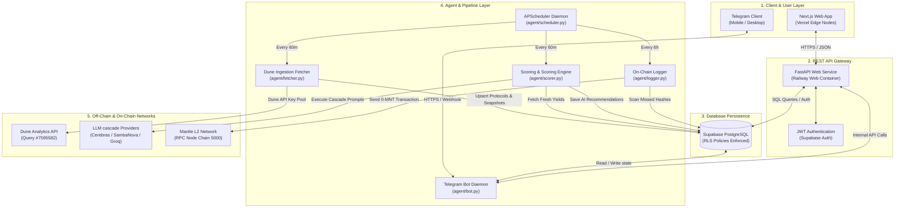
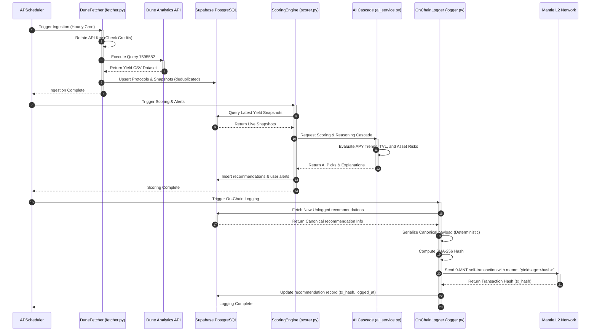
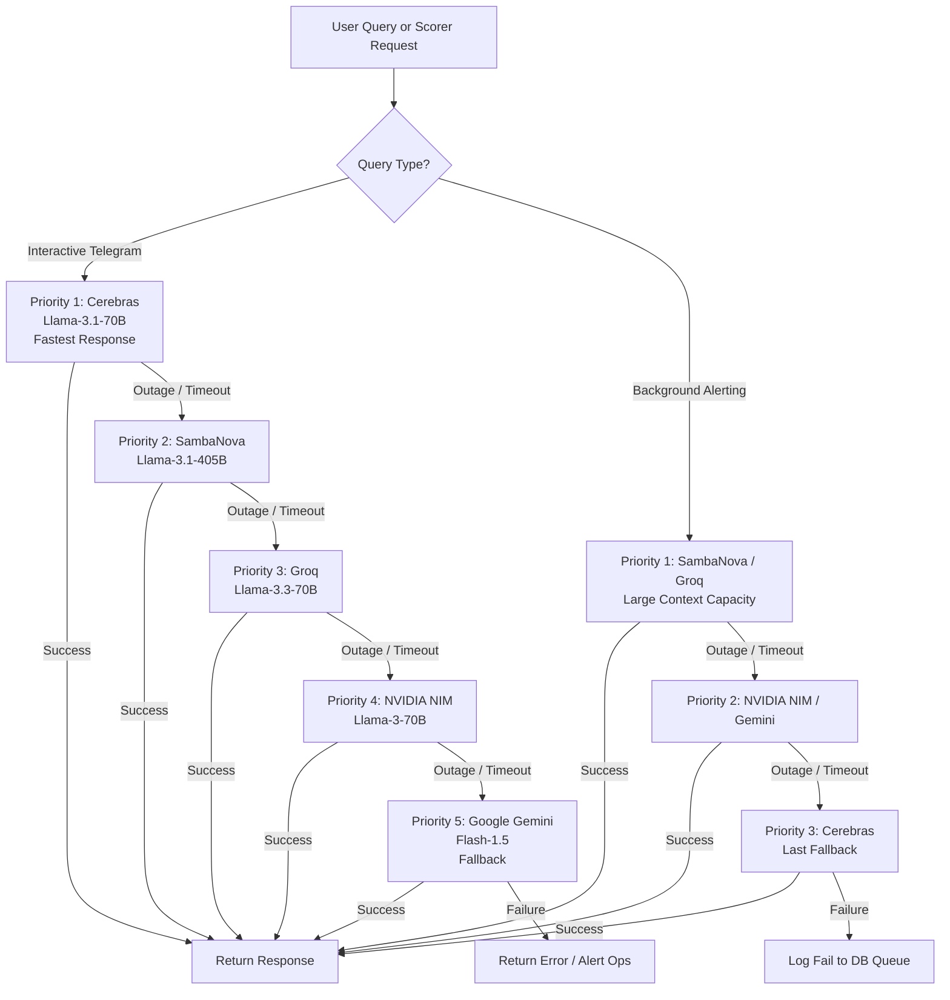
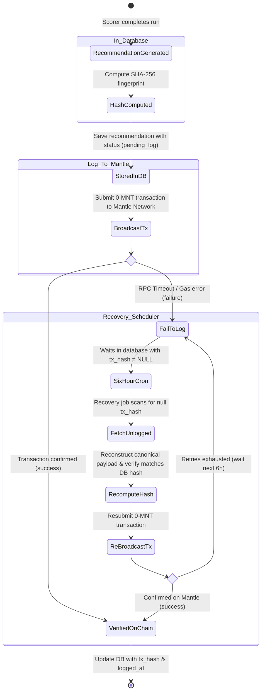

# YieldSage System Architecture

**Version:** 1.2.0 — June 2026  
**Target Platform:** Mantle Network (Chain ID 5000)  
**Security Level:** Production-ready (RLS-enforced + Cryptographically audited)

This document describes the high-level system topology, decoupled service interactions, and data-flow sequences that govern the YieldSage runtime ecosystem.

---

## 1. High-Level Decoupled Architecture

YieldSage is built on a decoupled, asynchronous multi-tier architecture to guarantee high availability, resilient data ingestion, and trustless verification.

---

## 2. Scheduled Pipeline Sequence Diagram

YieldSage operates on an automated 60-minute synchronization pipeline managed by `agent/scheduler.py`. This diagram shows the chronology of actions during an hourly run.

---

## 3. Multi-LLM Cascade & Outage Recovery Flow

To ensure uninterrupted service, YieldSage routes queries through a priority queue of LLM providers. If a provider rate-limits or returns an error, the engine instantly falls back.

---

## 4. On-Chain Commit & Recovery Lifecycle

If RPC latency or gas price fluctuations cause the initial Mantle transaction to fail, the system falls back to a 6-hourly recovery pipeline to ensure every recommendation is eventual-consistent on-chain.

---

## 5. Deployment & Security Architecture

### Network Configuration
*   **Vercel:** Hosts the Next.js frontend app. Traffic is routed through Vercel's global CDN Edge Nodes for maximum speed.
*   **Railway:** Runs the FastAPI web backend, Telegram listener daemon, and scheduled background workers within an isolated Docker private network.
*   **Supabase:** Secure PostgreSQL database layer. Port access is locked down; all user CRUD queries must validate against Row Level Security (RLS) rules matching the authenticated Supabase JWT.

### Key Management
*   **System Wallets:** Private keys required for signing Mantle transactions are injected directly into Railway environment variables. They are never committed to git or stored in public database columns.
*   **RPC Node Redundancy:** The Python `Web3` client contains automatic fallback routing. If `rpc.mantle.xyz` fails, it rotates requests to backup public RPC endpoints (e.g. `ankr.com/mantle`, `infura.io`) to ensure transactions are processed.
