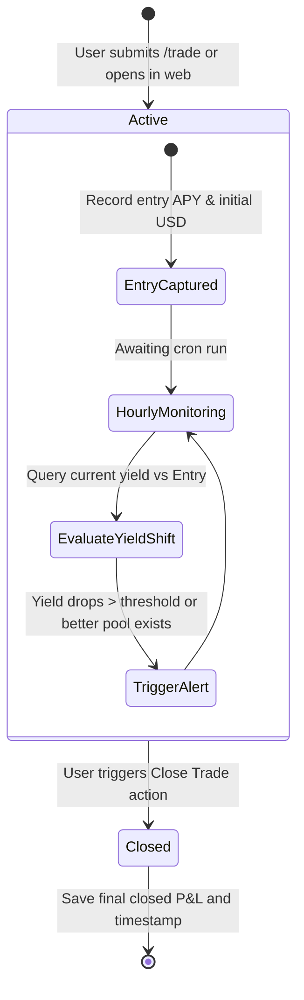
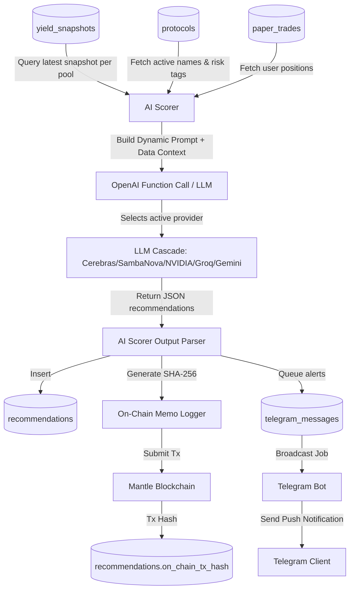

# YieldSage System Design

This document details the database schema design, the paper trading simulation engine, the AI scoring pipeline, and security enforcement policies for the YieldSage platform.

---

## 1. Database Schema & Entity Relationships

YieldSage uses a relational PostgreSQL database hosted on Supabase. Below is the Entity-Relationship Diagram (ERD) detailing the schema relations and constraints.

### Entity-Relationship Diagram (ERD)

```mermaid
erDiagram
    USERS ||--|| ALERT_PREFERENCES : "has (one-to-one)"
    USERS ||--o{ PAPER_TRADES : "simulates (one-to-many)"
    USERS ||--o{ TELEGRAM_MESSAGES : "receives (one-to-many)"
    USERS ||--o{ CHAT_MEMORY : "owns (one-to-many)"
    
    PROTOCOLS ||--o{ YIELD_SNAPSHOTS : "has historical (one-to-many)"
    PROTOCOLS ||--o{ RECOMMENDATIONS : "recommended-in (one-to-many)"
    PROTOCOLS ||--o{ PAPER_TRADES : "linked-to (one-to-many)"

    USERS {
        uuid id PK
        text email "UNIQUE, NOT NULL"
        text full_name
        bigint telegram_chat_id "UNIQUE, NULL"
        text risk_preference "stable,moderate,aggressive"
        timestamptz created_at
        timestamptz updated_at
    }

    ALERT_PREFERENCES {
        uuid id PK
        uuid user_id FK "UNIQUE, NOT NULL"
        numeric stable_apy_threshold
        numeric moderate_apy_threshold
        numeric aggressive_apy_threshold
        boolean is_active "DEFAULT true"
        timestamptz created_at
        timestamptz updated_at
    }

    PAPER_TRADES {
        uuid id PK
        uuid user_id FK "NOT NULL"
        uuid protocol_id FK "NOT NULL"
        numeric simulated_investment_usd "NOT NULL"
        numeric entry_apy "NOT NULL"
        text status "active | closed"
        timestamptz closed_at
        timestamptz created_at
    }

    PROTOCOLS {
        uuid id PK
        text slug "UNIQUE, NOT NULL"
        text name "NOT NULL"
        text pool_name "NOT NULL"
        text pool_address "NOT NULL"
        text risk_tag "stable | moderate | aggressive"
        text chain "DEFAULT 'mantle'"
        text image_url
        text app_link
        boolean is_active "DEFAULT true"
        timestamptz created_at
    }

    YIELD_SNAPSHOTS {
        uuid id PK
        uuid protocol_id FK "NOT NULL"
        numeric apy "NOT NULL"
        numeric base_apy
        numeric reward_apy
        numeric tvl_usd
        text reward_tokens
        numeric apy_1d
        numeric apy_7d
        numeric apy_30d
        jsonb raw_payload
        timestamptz fetched_at
    }

    RECOMMENDATIONS {
        uuid id PK
        uuid protocol_id FK "NOT NULL"
        text risk_tag "stable | moderate | aggressive"
        integer rank "NOT NULL"
        numeric apy_at_time "NOT NULL"
        text ai_reasoning "NOT NULL"
        text ai_model "NOT NULL"
        text on_chain_tx_hash "UNIQUE"
        timestamptz on_chain_logged_at
        text recommendation_hash "NOT NULL"
        timestamptz created_at
    }

    TELEGRAM_MESSAGES {
        uuid id PK
        uuid user_id FK "NULL (broadcast)"
        bigint chat_id "NOT NULL"
        text message_type "daily_push | query_response | alert"
        text content "NOT NULL"
        text status "pending | sent | failed"
        timestamptz sent_at
        text error_message
    }

    CHAT_MEMORY {
        uuid id PK
        uuid user_id FK "NULL"
        bigint telegram_chat_id "NULL"
        text role "user | assistant"
        text content "NOT NULL"
        timestamptz created_at
    }

    AGENT_ERRORS {
        uuid id PK
        text job_type "fetch | score | onchain_log | telegram_push"
        text error_message "NOT NULL"
        text stack_trace
        integer retry_count "DEFAULT 0"
        boolean resolved "DEFAULT false"
        timestamptz created_at
    }
```

---

## 2. Paper Trading Simulation Engine

The YieldSage Paper Trading Engine allows users to open mock yield-bearing positions and track interest accumulation without deploying real capital. This serves as a risk-free Sandbox environment to test strategies and monitor yield shifts.

### Mathematical Accrual Model

Yield accrued is computed using continuous-time calculation. Given:
- $I_0$: Simulated investment amount in USD (`simulated_investment_usd`)
- $APY$: The current APY of the pool (expressed as a decimal, e.g., $17.50\% \to 0.1750$)
- $T_{entry}$: Time the trade was opened (`created_at`)
- $T_{now}$: Current system time

The fractional days held is calculated as:
$$D = \max\left(\frac{T_{now} - T_{entry}}{86400 \text{ seconds}}, 0\right)$$

The estimated interest earned ($Profit$) is:
$$Profit = I_0 \times \left(\frac{APY}{100}\right) \times \left(\frac{D}{365}\right)$$

And the current total value of the trade ($Value_{current}$) is:
$$Value_{current} = I_0 + Profit$$

### Trade Simulation Lifecycle

---

## 3. AI Scoring & Recommendation Pipeline

YieldSage runs an automated scoring loop that aggregates live yields, checks TVLs, compares historical risk, and generates daily ranked recommendations per risk tier.

### Recommendations Data Flow

---

## 4. Security & RLS (Row Level Security) Policies

To protect sensitive user data (such as simulated portfolio sizes and Telegram chat IDs), PostgreSQL Row Level Security (RLS) is enabled on all tables in Supabase. The REST backend and the database authorize requests using JWTs issued by Supabase Auth.

- **`users`**:
  - `SELECT / UPDATE`: `auth.uid() = id` (Users can only read/update their own profile data).
- **`paper_trades`**:
  - `SELECT / INSERT / UPDATE / DELETE`: `auth.uid() = user_id` (Trades are private to the simulating user).
- **`alert_preferences`**:
  - `SELECT / INSERT / UPDATE`: `auth.uid() = user_id` (Alert thresholds are user-specific).
- **`chat_memory`**:
  - `SELECT / INSERT`: `auth.uid() = user_id` OR `telegram_chat_id` match.
- **`yield_snapshots` & `recommendations`**:
  - `SELECT`: `true` (Publicly readable to power the dashboard and history pages).
  - `INSERT / UPDATE / DELETE`: `false` (Write access strictly restricted to the `service_role` administrator client).
