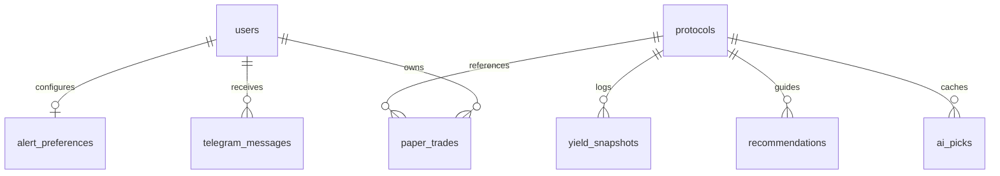

# YieldSage System Design Blueprint

**Version:** 1.2.0 — June 2026  
**System Class:** Financial Intelligence & Cryptographic Logging Agent  
**Host Target:** Railway (Backend) & Vercel (Frontend)

This document specifies the internal design, database structures, algorithmic pathways, and operational parameters of the YieldSage yield intelligence engine.

---

## 1. System Design Principles & Decoupled Layout

YieldSage decouples concerns into independent service boundaries interacting asynchronously through a shared PostgreSQL database and blockchain network:

```
┌───────────────────────────────────────────────────────────────────────────────┐
│                                SYSTEM BOUNDARY                                │
├────────────────────────────┬──────────────────────────────────────────────────┤
│ Ingestion & Scheduler      │ agent/fetcher.py, agent/scheduler.py             │
├────────────────────────────┼──────────────────────────────────────────────────┤
│ AI Intelligence & Scoring  │ agent/ai_service.py, agent/scorer.py             │
├────────────────────────────┼──────────────────────────────────────────────────┤
│ Verifiability Log          │ agent/logger.py, Mantle L2                       │
├────────────────────────────┼──────────────────────────────────────────────────┤
│ Gateway REST API           │ agent/main.py, agent/routers/                    │
├────────────────────────────┼──────────────────────────────────────────────────┤
│ Client UI                  │ Next.js 14 Web App, Telegram Bot                 │
└────────────────────────────┴──────────────────────────────────────────────────┘
```

---

## 2. Complete Database Schema & RLS Policies

YieldSage utilizes Supabase PostgreSQL for persistence. The database is secured via Row-Level Security (RLS) policies to protect user-specific data while keeping yield feeds public.



### 2.1 Table Schemas & Constraints

#### Table: `users`
Represents registered users interacting via Web UI or Telegram.
```sql
CREATE TABLE public.users (
    id UUID PRIMARY KEY DEFAULT gen_random_uuid(),
    email TEXT UNIQUE,
    full_name TEXT,
    telegram_chat_id BIGINT UNIQUE,
    risk_preference TEXT DEFAULT 'stable,moderate,aggressive',
    created_at TIMESTAMPTZ DEFAULT NOW()
);
```

#### Table: `protocols`
The canonical directory of tracked yield contracts and metadata.
```sql
CREATE TABLE public.protocols (
    id UUID PRIMARY KEY DEFAULT gen_random_uuid(),
    slug TEXT UNIQUE NOT NULL,
    name TEXT NOT NULL,
    pool_name TEXT NOT NULL,
    pool_address TEXT NOT NULL,
    risk_tag TEXT NOT NULL CHECK (risk_tag IN ('stable', 'moderate', 'aggressive')),
    chain TEXT DEFAULT 'mantle',
    image_url TEXT,
    app_link TEXT,
    is_active BOOLEAN DEFAULT TRUE,
    created_at TIMESTAMPTZ DEFAULT NOW(),
    CONSTRAINT unique_protocol_pool UNIQUE (name, pool_address)
);
CREATE INDEX idx_protocols_active ON public.protocols(is_active) WHERE is_active = TRUE;
CREATE INDEX idx_protocols_slug ON public.protocols(slug);
```

#### Table: `yield_snapshots`
Time-series metrics parsed from Dune Analytics feeds.
```sql
CREATE TABLE public.yield_snapshots (
    id UUID PRIMARY KEY DEFAULT gen_random_uuid(),
    protocol_id UUID NOT NULL REFERENCES public.protocols(id) ON DELETE CASCADE,
    asset TEXT NOT NULL,
    apy DOUBLE PRECISION NOT NULL,
    base_apy DOUBLE PRECISION NOT NULL DEFAULT 0.0,
    reward_apy DOUBLE PRECISION NOT NULL DEFAULT 0.0,
    tvl_usd DOUBLE PRECISION NOT NULL,
    reward_tokens TEXT,
    apy_1d DOUBLE PRECISION DEFAULT 0.0,
    apy_7d DOUBLE PRECISION DEFAULT 0.0,
    apy_30d DOUBLE PRECISION DEFAULT 0.0,
    raw_payload JSONB,
    fetched_at TIMESTAMPTZ NOT NULL DEFAULT NOW()
);
CREATE INDEX idx_yield_snapshots_proto_date ON public.yield_snapshots(protocol_id, fetched_at DESC);
```

#### Table: `recommendations`
AI decisions fingerprinted and logged to Mantle.
```sql
CREATE TABLE public.recommendations (
    id UUID PRIMARY KEY DEFAULT gen_random_uuid(),
    protocol_id UUID REFERENCES public.protocols(id) ON DELETE SET NULL,
    risk_tag TEXT NOT NULL,
    rank INTEGER NOT NULL,
    apy_at_time DOUBLE PRECISION NOT NULL,
    ai_reasoning TEXT NOT NULL,
    ai_model TEXT NOT NULL,
    recommendation_hash TEXT NOT NULL,
    on_chain_tx_hash TEXT,
    on_chain_logged_at TIMESTAMPTZ,
    created_at TIMESTAMPTZ DEFAULT NOW()
);
CREATE INDEX idx_recommendations_tx ON public.recommendations(on_chain_tx_hash);
CREATE INDEX idx_recommendations_created ON public.recommendations(created_at DESC);
```

#### Table: `paper_trades`
Simulated positions held by users.
```sql
CREATE TABLE public.paper_trades (
    id UUID PRIMARY KEY DEFAULT gen_random_uuid(),
    user_id UUID NOT NULL REFERENCES public.users(id) ON DELETE CASCADE,
    protocol_id UUID NOT NULL REFERENCES public.protocols(id) ON DELETE CASCADE,
    simulated_investment_usd DOUBLE PRECISION NOT NULL,
    entry_apy DOUBLE PRECISION NOT NULL,
    status TEXT DEFAULT 'active' CHECK (status IN ('active', 'closed')),
    created_at TIMESTAMPTZ DEFAULT NOW(),
    closed_at TIMESTAMPTZ
);
CREATE INDEX idx_paper_trades_user_status ON public.paper_trades(user_id, status);
```

#### Table: `alert_preferences`
Toggles for scheduled user notifications.
```sql
CREATE TABLE public.alert_preferences (
    user_id UUID PRIMARY KEY REFERENCES public.users(id) ON DELETE CASCADE,
    is_active BOOLEAN DEFAULT TRUE NOT NULL
);
```

#### Table: `telegram_messages`
Job queue database table for outbound telegram alerts.
```sql
CREATE TABLE public.telegram_messages (
    id UUID PRIMARY KEY DEFAULT gen_random_uuid(),
    user_id UUID REFERENCES public.users(id) ON DELETE CASCADE,
    chat_id BIGINT NOT NULL,
    message_type TEXT NOT NULL,
    content TEXT NOT NULL,
    status TEXT DEFAULT 'pending' CHECK (status IN ('pending', 'sent', 'failed')),
    error_message TEXT,
    created_at TIMESTAMPTZ DEFAULT NOW(),
    sent_at TIMESTAMPTZ
);
```

### 2.2 Row-Level Security (RLS) Policies

To protect private data, RLS is active on tables containing user identity attributes.

```sql
-- Enable RLS
ALTER TABLE public.users ENABLE ROW LEVEL SECURITY;
ALTER TABLE public.paper_trades ENABLE ROW LEVEL SECURITY;
ALTER TABLE public.alert_preferences ENABLE ROW LEVEL SECURITY;
ALTER TABLE public.telegram_messages ENABLE ROW LEVEL SECURITY;

-- 1. Users table policies
CREATE POLICY "Users can only read own profile" ON public.users
    FOR SELECT USING (auth.uid() = id);
CREATE POLICY "Users can only update own profile" ON public.users
    FOR UPDATE USING (auth.uid() = id);

-- 2. Paper Trades table policies
CREATE POLICY "Users can only access own trades" ON public.paper_trades
    FOR ALL USING (auth.uid() = user_id);

-- 3. Alert Preferences table policies
CREATE POLICY "Users can only configure own alerts" ON public.alert_preferences
    FOR ALL USING (auth.uid() = user_id);
```

---

## 3. Cryptographic Proof & Verification Pipeline

YieldSage implements mathematical verifiability to prevent database manipulation.

```
AI Model Output ──> Build Payload ──> Deterministic Sorting ──> SHA-256 Hash ──> Commit to Mantle (0-MNT)
```

### 3.1 Canonical Payload Schema
To ensure hash determinism across programming languages (Python and TypeScript), the recommendation details must be structured into a strict format:

```json
{
  "version": "1.0",
  "source": "dune_query_7595582",
  "scored_at": "2026-06-06T08:00:00Z",
  "risk_tag": "moderate",
  "rank": 1,
  "protocol_name": "Merchant Moe",
  "pool_name": "USDe-WMNT",
  "pool_address": "0x5d54d430d1fd9425976147318e6080479bffc16d",
  "apy_at_time": "18.4200",
  "tvl_usd": "4200000.00",
  "ai_reasoning": "This pool demonstrates high yield derived from Moe incentives...",
  "ai_model": "llama-3.3-70b",
  "chain": "mantle",
  "chain_id": 5000
}
```

### 3.2 Canonical Formatting Rules
1.  **Field Order:** Dict keys are alphabetically sorted during serialization.
2.  **Formatting Constraints:**
    *   `scored_at` must be formatted to ISO 8601 UTC string (`YYYY-MM-DDTHH:MM:SSZ`).
    *   `apy_at_time` is converted to a fixed-precision string with 4 decimal places.
    *   `tvl_usd` is converted to a fixed-precision string with 2 decimal places.
    *   `pool_address` is cast to all-lowercase.
    *   `ai_reasoning` is stripped of leading and trailing whitespace.
3.  **JSON Stringification:** Compact formatting with no spaces (`separators=(',', ':')` in Python, equivalent to `JSON.stringify(obj)` in browser JS).

### 3.3 Hashing Code Reference (Python vs JavaScript)

#### Python Implementation (`agent/logger.py`)
```python
import json
import hashlib

def get_canonical_hash(payload: dict) -> str:
    canonical = json.dumps(payload, sort_keys=True, separators=(",", ":"), ensure_ascii=True)
    return hashlib.sha256(canonical.encode("utf-8")).hexdigest()
```

#### TypeScript / Web Crypto Implementation (`frontend/app/verify/page.tsx`)
```typescript
async function computeHash(payloadObj: Record<string, any>): Promise<string> {
  const sortedObj = Object.keys(payloadObj).sort().reduce((acc, key) => {
    acc[key] = payloadObj[key];
    return acc;
  }, {} as Record<string, any>);
  
  const jsonString = JSON.stringify(sortedObj);
  const encoder = new TextEncoder();
  const data = encoder.encode(jsonString);
  const hashBuffer = await crypto.subtle.digest("SHA-256", data);
  const hashArray = Array.from(new Uint8Array(hashBuffer));
  return hashArray.map(b => b.toString(16).padStart(2, "0")).join("");
}
```

---

## 4. Key Configuration & Environment Variables

The system relies on a unified `.env` configuration file distributed to backend components:

```ini
# Database (Supabase)
SUPABASE_URL=https://<id>.supabase.co
SUPABASE_ANON_KEY=<anon_key>
SUPABASE_SERVICE_ROLE_KEY=<service_role_key>

# Blockchain Connection (Mantle L2)
MANTLE_RPC_URL=https://rpc.mantle.xyz
YIELDSAGE_WALLET_PRIVATE_KEY=0x<hex_private_key>

# Ingestion Keys (Dune Analytics)
DUNE_API_KEYS=key1,key2,key3

# AI Inference Providers
CEREBRAS_API_KEY=sb_...
SAMBANOVA_API_KEY=sn_...
GROQ_API_KEY=gq_...
NVIDIA_NIM_API_KEY=nv_...
GEMINI_API_KEY=AIzaSy...

# Telegram Bot
TELEGRAM_BOT_TOKEN=<bot_token>
```

---

## 5. Scheduler Pipeline Configuration

The FastAPI worker process runs `agent/scheduler.py` driven by `APScheduler`:

| Process | Interval | Sub-modules Triggered | Purpose |
|---|---|---|---|
| **Ingestion Pipeline** | `0 * * * *` (Hourly) | `fetcher.py` | Pulls yield data from Dune API, rotates keys, upserts database protocols and snapshots. |
| **Scoring & Alerting** | `5 * * * *` (Hourly) | `scorer.py`, `ai_service.py` | Triggers LLM Cascade evaluation of yields, writes public picks, writes user alert queue entries. |
| **Transaction Recovery** | `0 */6 * * *` (6-hourly) | `logger.py` | Scans recommendations for missing transaction hashes, commits them, updates DB. |
| **Telegram Delivery** | Continuous | `bot.py` | Polls the `telegram_messages` queue, broadcasts alert messages with exponential-backoff retries. |
