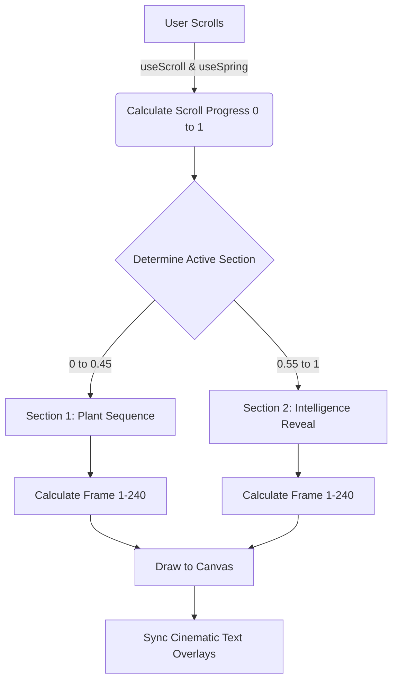
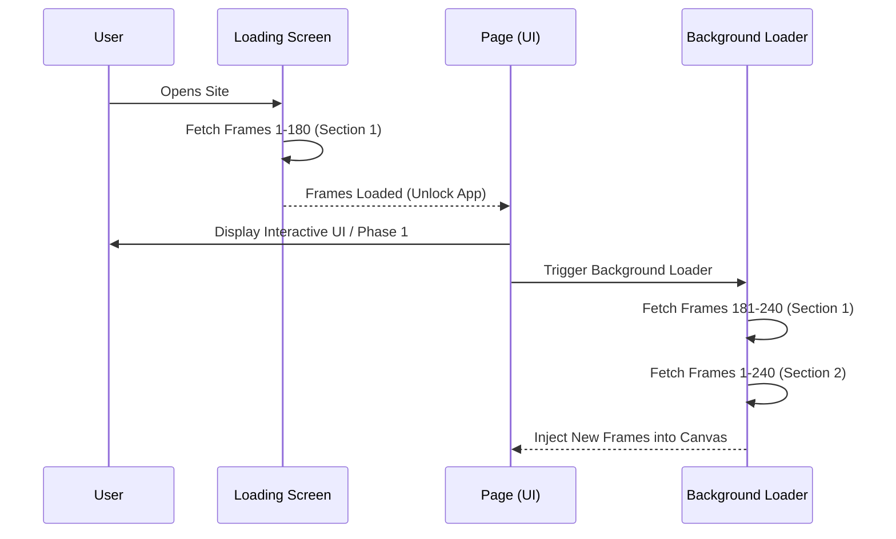

# YieldSage Frontend: UI/UX Architecture

This document covers the frontend architecture, focusing exclusively on the highly polished, cinematic UI/UX layer constructed for YieldSage. 

*Note: Backend integration, smart contract interactions, and the core app dashboard are pending in the next phase of development. This document reflects the completed UI/UX architectural foundation.*

## Overview

The YieldSage frontend is a Next.js (React) application designed to deliver a premium, luxury fintech aesthetic. The core visual language revolves around deep, true blacks (`#050505`) and the vibrant Mantle Network green (`#00ff88`). 

The user experience is anchored by a complex, high-performance "scrollytelling" engine that ties 3D sequence frame rendering to the user's scroll position.

---

## Key UI/UX Features Built

### 1. The Scrollytelling Engine

The centerpiece of the landing page is a 1300vh scrolling experience that scrubs through a massive 480-frame 3D animation sequence.

* **Canvas Scrubbing:** We render high-resolution JPEGs directly onto an HTML5 `<canvas>` using `requestAnimationFrame`. The frame index is perfectly interpolated against Framer Motion's `useScroll` and `useSpring` to ensure buttery-smooth playback tied to organic scroll physics.
* **Cinematic Overlays:** Text content is broken into distinct "Phases". As the user scrolls, text blocks fade in, translate vertically on the Y-axis, and fade out, perfectly timed to key moments in the 3D animation (e.g., the plant sprouting).
* **Graceful Degradation:** The canvas engine handles sparse frame arrays dynamically. If a user scrolls exceptionally fast, the engine falls back to the nearest loaded frame to prevent blank flashes or stuttering.

### 2. Progressive Frame Loading Architecture

To deliver 480 high-resolution images (~145MB total) without a 30-second blocking load screen, we engineered a progressive loading system.

* **Initial Block (180 Frames):** The custom loading screen holds the user while the first 180 frames of Section 1 download. This ensures the first ~70% of the initial scroll experience is perfectly cached and buttery smooth.
* **Background Hydration:** Once the first 180 frames load, the app unlocks. The remaining 60 frames of Section 1, and the entire 240 frames of Section 2, silently stream in the background. The canvas auto-refreshes as new frames arrive.

### 3. The Cinematic Loading Screen

The loading screen isn't just functional; it's a core piece of the brand experience designed to build anticipation.

* **Glitch Typography:** The "YIELDSAGE" text initializes with a cryptographic character scramble effect, settling into the final text frame-by-frame.
* **Laser Scanline:** A glowing green gradient sweeps across the central logo, accompanied by orbiting status dots on inverse rotations.
* **Real-time Progress:** A highly stylized progress bar and hex-grid readout track the exact percentage of the initial 180-frame buffer.

### 4. Ambient & Micro-Interactions

We implemented several subtle visual effects to ensure the site feels "alive" even when the user isn't actively scrolling:

* **Scroll to Explore:** A glassmorphism scroll indicator sits at the bottom of the initial view, featuring a pulsating mouse wheel and bouncing chevron to draw the user downward. It fades seamlessly into the darkness upon first scroll.
* **Floating Particles:** Ambient glowing particles drift upwards in the background specifically during the emotional peaks of the scroll journey (e.g., when the branding is revealed).
* **Mouse Gradient:** A reactive, blurred radial gradient follows the user's cursor across non-canvas sections of the site, illuminating the deep black background.
* **CRT/Vignette:** Global CSS overlays apply a subtle cinematic grading (vignetting and faint scanlines) to the entire viewport to unify the 3D renders with the DOM elements.
